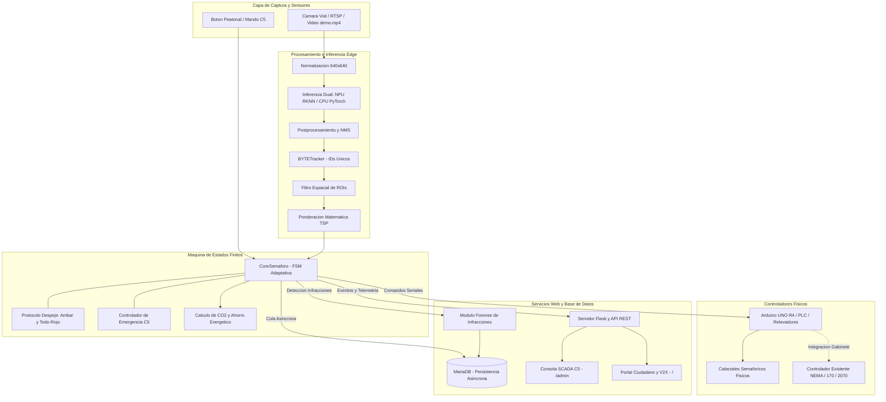

# FLUXA: Sistema de Control Semafórico Inteligente y Telemetría Edge

<div align="center">


-005500?style=for-the-badge)


**Tecnológico de Estudios Superiores de Coacalco (TESCo)**  
*División de Ingeniería en Sistemas Computacionales • Tecnológico Nacional de México (TecNM)*  
*Desarrollador Principal y Titular de Derechos: Moisés Emilio Martínez Arias*  
*Proyecto de Innovación Tecnológica y Emprendimiento en Movilidad Inteligente (Smart Mobility)*

[Manual Técnico para Desarrolladores](docs/MANUAL_TECNICO.md) • [Modelo de Negocio B2G y ROI](docs/MODELO_NEGOCIO_B2G.md) • [Plan de Entrenamiento](docs/PLAN_ENTRENAMIENTO.md) • [Especificación de APIs](#especificación-de-interfaces-web-y-apis)

</div>

---

## 1. Descripción General del Sistema

**FLUXA** es una plataforma de **Inteligencia y Orquestación Edge para Tráfico Urbano** diseñada para modernizar intersecciones viales sin requerir el reemplazo de los gabinetes electromecánicos ni cabezales semafóricos existentes.

El sistema opera como una **capa de control superpuesta (*Overlay Controller*)**, compatible con estándares normativos (NEMA TS2, Tipo 170/2070 o interfaces de relevadores directos vía microcontrolador o PLC):

* **Visión Computacional en el Borde (YOLOv8 + BYTETracker):** Cuantificación de colas vehiculares carril por carril y monitoreo de peatones con latencias de inferencia inferiores a **12 ms** en NPU Rockchip RK3588 (Orange Pi 5) o CPU x86/ARM64.
* **Prioridad de Transporte Público (TSP) y Corredores de Emergencia C5:** Ajuste dinámico de tiempos de verde asignando mayor peso al transporte masivo y despeje seguro de vía para vehículos de emergencia mediante intervalos normativos de Ámbar y Todo-Rojo.
* **Sustentabilidad y Analítica V2X:** Reducción de hasta un **60% en tiempos de ralentí vehicular**, mitigación de emisiones de CO₂ y emisión de telemetría de velocidad óptima (GLOSA / SPaT) para vehículos conectados.
* **Auditoría Forense de Infracciones:** Detección de cruces en fase roja con captura fotográfica automática, rotación FIFO de almacenamiento y persistencia asíncrona tolerante a fallos.

```
                  ┌───────────────────────────────────────────────────────────┐
                  │                      SISTEMA FLUXA                        │
                  ├─────────────────────────────┬─────────────────────────────┤
                  │     Semáforo Tradicional    │       FLUXA Edge AI         │
├─────────────────┼─────────────────────────────┼─────────────────────────────┤
│ Asignación Fase │ 45s fijos (Calle vacía)     │ Dinámica (5s a 45s por cola)│
│ Prioridad Bus   │ Ninguna                     │ TSP Ponderado (Factor 4.0x) │
│ Huella de CO₂   │ Alta por ralentí inútil     │ Reducción de hasta el 60%   │
│ Emergencias C5  │ Manual o inexistente        │ Despeje Vial Seguro (C5)    │
│ Autos Conectados│ Desconectado                │ V2X Broadcast (SPaT/GLOSA)  │
│ Integración     │ Rígido                      │ Capa Overlay (NEMA / MCU)   │
└─────────────────┴─────────────────────────────┴─────────────────────────────┘
```

> [!IMPORTANT]
> **Arquitectura de Inferencia y Aceleración por Plataforma:**
> * **Aceleración NPU (Hardware Dedicado):** Disponible **única y exclusivamente en la computadora de placa reducida (SBC) Orange Pi 5 (SoC Rockchip RK3588 con 3 núcleos NPU de 6 TOPS)** bajo el sistema operativo **Armbian Linux**. En esta plataforma se ejecutan los modelos compilados y cuantizados en formato `.rknn` (`yolov8n.rknn`, `yolov8s.rknn`, `yolov8m.rknn`).
> * **Inferencia por CPU (PyTorch Estándar):** En todos los demás sistemas operativos y entornos de desarrollo/servidor sobre arquitectura **x86_64** (openSUSE Tumbleweed/Leap, Fedora, RHEL, Ubuntu, Debian), la inferencia de visión por computadora se ejecuta íntegramente a través de la **CPU** utilizando el modelo PyTorch estándar **`yolov8n.pt`**. Esto garantiza portabilidad total y despliegue inmediato sin requerir aceleradores propietarios.

---

## 2. Diagrama de Arquitectura del Sistema



---

## 3. Especificaciones de Ingeniería

### 3.1. Inferencia Dual con Tolerancia a Fallos (NPU / CPU)

| Plataforma / Entorno | Hardware & Sistema Operativo | Motor de Inferencia | Modelo / Formato | Latencia Promedio |
| :--- | :--- | :--- | :--- | :--- |
| **Producción Edge (Objetivo Principal)** | Orange Pi 5 (RK3588 ARM64) • **Armbian 24.04** | **NPU RKNN Hardware** (3 Núcleos / 6 TOPS) | `yolov8n.rknn` (INT8) | **~3.4 ms a 14 ms** |
| **Desarrollo y Servidores x86_64** | openSUSE, Ubuntu, Fedora, Debian, RHEL (x86_64) | **CPU (PyTorch Engine)** | `yolov8n.pt` (FP32/INT8) | **~25 ms a 45 ms** |
| **Fail-Safe Fallback Automático** | Orange Pi 5 (en caso de contingencia NPU) | **CPU Fallback Automático** | `yolov8n.pt` | **~50 ms a 70 ms** |

* **Aceleración NPU Exclusiva para Orange Pi 5 (Armbian):** Los modelos cuantizados en formato INT8 (`yolov8n.rknn`, `yolov8s.rknn`, `yolov8m.rknn`) están diseñados específicamente para el chip Rockchip RK3588 bajo el sistema operativo **Armbian Linux**.
* **Inferencia por CPU en Arquitecturas x86_64:** En estaciones de trabajo, laptops y servidores bajo openSUSE, Ubuntu, Fedora o Debian, la ejecución se realiza enteramente vía CPU utilizando el modelo PyTorch estándar **`yolov8n.pt`**.
* **Fail-Safe Fallback Automático:** Si la librería `rknnlite`, el controlador del acelerador o el archivo `.rknn` presentan fallas en tiempo de ejecución en la Orange Pi 5, el sistema conmuta automáticamente y sin interrupción al motor PyTorch en CPU (`yolov8n.pt`).

### 3.2. Módulo Forense de Infracciones y Cuotas de Almacenamiento
* **Detección Espaciotemporal:** Validación automática de cruces vehiculares durante fase roja en carriles conflictivos.
* **Persistencia Multicapa:** Registro en MariaDB con respaldo simultáneo en búfer circular de memoria RAM y escaneo de disco para asegurar disponibilidad inmediata incluso sin base de datos.
* **Control de Almacenamiento:** Política FIFO automática con límites configurables (por defecto 300 capturas y 150 MB máximo) para proteger el almacenamiento del hardware en campo.

### 3.3. Seguridad Criptográfica y Gestión de Credenciales
* **Autenticación Basada en PBKDF2-SHA256:** Las credenciales del operador C5 se almacenan exclusivamente como hashes criptográficos en `instance/admin_credentials.json` con permisos de sistema `0600`.
* **Configuración Segregada:** Los archivos con credenciales locales (`config.json`, `.env`, `instance/`) se encuentran desindexados del repositorio. El proyecto distribuye la plantilla pública `config.example.json`.
* **Instalador Interactivo:** `install.sh` solicita contraseñas de forma segura durante el despliegue o genera cadenas aleatorias de alta entropía.

---

## 4. Catálogo de Topologías Viales Soportadas

| Topología CLI | Nombre del Cruce | Descripción Operativa |
| :--- | :--- | :--- |
| `4_way` | **4 Vías Clásica** | Intersección ortogonal de 4 accesos (Eje Norte-Sur vs Eje Este-Oeste). |
| `2_way` | **2 Vías / Avenida** | Avenida bidireccional continua con optimización de flujo por sentido (Zona A vs B). |
| `3_way_t` | **3 Vías Tipo T** | Intersección en T (Avenida Principal continua vs Calle Secundaria). |
| `4_way_protected` | **Giro Protegido** | 4 vías con fase exclusiva de flecha izquierda y salto inteligente de fase vacía (*Phase-skipping*). |
| `pedestrian` | **Cruce Peatonal** | Cruce *mid-block* con detección de demanda peatonal en banqueta y tiempos seguros de cruce. |

---

## 5. Instalación y Despliegue

### Método 1: Instalador Universal Nativo (Recomendado para Producción & Edge)
Compatible con **Armbian 24.04 (Orange Pi 5)**, **openSUSE (Tumbleweed, Leap 15+, SLES, MicroOS)**, **Fedora/RHEL**, **Ubuntu** y **Debian**:

```bash
git clone https://github.com/Pozole98/fluxa-smart-city.git
cd fluxa-smart-city
bash install.sh
```

El script detecta automáticamente el gestor de paquetes de tu distribución (`zypper`, `dnf`, `apt`), instala MariaDB, bibliotecas OpenGL/V4L2, dependencias de compilación, configura reglas `udev` de hardware, despliega el entorno virtual `.venv`, crea el acceso global `fluxa` y registra la unidad de servicio `systemd`.

Para desinstalar limpiamente:
```bash
bash uninstall.sh
```

---

### Método 2: Despliegue con Contenedores (Docker / Podman)
```bash
# Iniciar servicios en segundo plano
docker compose up -d

# Visualizar registros
docker compose logs -f
```

---

## 6. Ejecución del Sistema

### Ejecución por Línea de Comandos (CLI)
```bash
# Intersección de 4 vías en CPU con clip demo en puerto 5000
fluxa --topology 4_way --backend cpu --headless --video videos/demo.mp4 --port 5000

# Intersección en Orange Pi 5 (NPU RK3588 con aceleración por hardware)
fluxa --topology 4_way --backend rknn --headless --port 5000
```

### Control del Servicio de Gabinete Vial (Systemd)
```bash
sudo systemctl start fluxa      # Iniciar servicio
sudo systemctl stop fluxa       # Detener servicio
sudo systemctl restart fluxa    # Reiniciar servicio
journalctl -u fluxa -f          # Telemetría en tiempo real
```

---

## 7. Especificación de Interfaces Web y APIs

Al iniciar el servicio, los siguientes puntos de acceso quedan habilitados en el puerto configurado (por defecto `5000`):

| Endpoint / Vista | Ruta | Nivel de Acceso | Descripción |
| :--- | :--- | :--- | :--- |
| **Portal Ciudadano** | `/` | Público | Visualización de tráfico, estado semafórico, métricas de sustentabilidad y recomendación V2X (GLOSA). |
| **Autenticación C5** | `/login` | Público | Inicio de sesión para operadores de control con protección de tasa de intentos (*Rate Limiting*). |
| **Centro de Mando SCADA C5** | `/admin` | Operador C5 | Mando de emergencias, conmutador de modelos YOLO, selector de video y visor de infracciones. |
| **Calibrador Visual Canvas** | `/admin` (Modal) | Operador C5 | Edición gráfica interactiva de polígonos de carriles con recarga en caliente (*Hot-Reload*). |
| **Informe Ejecutivo Oficial** | `/report/executive` | Operador C5 | Reporte de movilidad urbana y auditoría vial listo para exportar a PDF (`Ctrl + P`). |
| **Streaming de Video MJPEG** | `/video_feed` | Público | Transmisión de video continua con HUD semafórico y cajas de seguimiento de IA. |
| **API Telemetría Global** | `/api/status` | Público | Métricas de aforo vehicular, FPS, estado de FSM, hardware y watchdog de Arduino. |
| **API Infracciones** | `/api/violations` | Operador C5 | Consulta de registros de cruces en luz roja con enlaces a evidencia fotográfica. |

---

## 8. Estructura del Repositorio

```text
yolov8_semaforo_advanced/
├── config.example.json       # Plantilla maestra de configuración (sanitizada)
├── main.py                   # Punto de entrada universal por CLI
├── requirements.txt          # Dependencias de Python
├── yolov8n.pt                # Pesos neuronales YOLOv8 Nano para CPU
├── models/                   # Modelos cuantizados (.rknn) para Orange Pi 5 NPU
├── docs/
│   ├── MANUAL_TECNICO.md     # Manual técnico detallado para ingeniería y desarrollo
│   ├── PLAN_ENTRENAMIENTO.md # Guía de entrenamiento, fine-tuning y cuantización RKNN
│   └── arquitectura.mmd      # Diagrama de arquitectura del sistema en Mermaid
├── logs/
│   └── violations/           # Fotografías de evidencia de infracciones en luz roja
├── videos/
│   └── demo.mp4              # Clip de video estándar para demostración y pruebas
├── src/                      # Módulos del núcleo del sistema
│   ├── cli.py                # Analizador CLI y presentación de consola
│   ├── core_semaforo.py      # Clase base de control semafórico, FSM, ROIs, TSP y fotomultas
│   ├── core_semaforo_rknn.py # Controlador para aceleración NPU RKNN con fallback a CPU
│   ├── db_manager.py         # Gestor asíncrono MariaDB con búfer local tolerante a fallos
│   ├── hardware_monitor.py   # Telemetría de hardware (CPU, temperatura, RAM, disco)
│   ├── api_server.py         # Servidor Web Flask, APIs REST, autenticación y streaming
│   ├── videostream.py        # Ingestión de video en hilo secundario con reconexión
│   ├── ui4_way_cpu.py / ui4_way.py
│   ├── ui2_way_cpu.py / ui2_way.py
│   ├── ui3_tee_cpu.py / ui3_tee.py
│   ├── ui4_protected_cpu.py / ui4_protected.py
│   └── ui_pedestrian_cpu.py / ui_pedestrian.py
├── systemd/
│   ├── fluxa.service         # Unidad de servicio systemd
│   └── install_service.sh    # Script de despliegue de servicio
└── templates/                # Plantillas Web (HTML5 / Vanilla CSS / JS)
    ├── index.html            # Consola SCADA C5 y Calibrador Visual Canvas
    ├── public.html           # Portal Ciudadano de Movilidad
    ├── login.html            # Portal de Autenticación C5
    └── report_executive.html # Reporte Oficial de Auditoría Vial en PDF
```

---

## 9. Propiedad Intelectual y Licenciamiento Comercial

Este software constituye una obra propietaria protegida por las leyes de Propiedad Intelectual aplicables (Ley Federal del Derecho de Autor / INDAUTOR y tratados internacionales de la OMPI).

**Todos los derechos morales y patrimoniales reservados © 2026.**  
Queda prohibida su reproducción, distribución, venta, ingeniería inversa o uso en licitaciones públicas sin la formalización de un contrato de licencia comercial.

* **Desarrollador Principal y Titular:** Moisés Emilio Martínez Arias
* **Institución de Respaldo Académico:** Tecnológico de Estudios Superiores de Coacalco (TESCo) • Tecnológico Nacional de México (TecNM)
* **División:** Ingeniería en Sistemas Computacionales
* **Modelo de Implementación:** Consultar [Modelo de Negocio B2G y Viabilidad Financiera](docs/MODELO_NEGOCIO_B2G.md) para detalles sobre adquisición de kits *Edge Appliance*, licenciamiento por intersección y convenios de vinculación tecnológica.
* **Licencia Completa:** Consultar el archivo [LICENSE.md](LICENSE.md).
