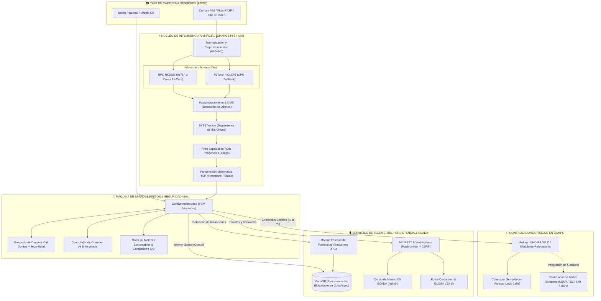

# 🚦 FLUXA • Sistema Integrado de Control Semafórico Inteligente y Telemetría Edge

<div align="center">


-red?style=for-the-badge&logo=raspberrypi&logoColor=white)


**Tecnológico de Estudios Superiores de Coacalco (TESCo)**  
*División de Ingeniería en Sistemas Computacionales • Proyecto Smart Cities 2026*

[📖 Manual Técnico para Desarrolladores](docs/MANUAL_TECNICO.md) • [🌐 Arquitectura y APIs](#-especificación-de-interfaces-web-y-apis) • [🚀 Guía Rápida](#-guía-rápida-de-instalación-y-uso)

</div>

---

## 🌟 ¿Qué es FLUXA?

**FLUXA** es una plataforma de **Inteligencia y Orquestación Edge para Tráfico Urbano** diseñada para modernizar la infraestructura semafórica sin requerir la sustitución costosa de los gabinetes y cabezales existentes. 

FLUXA actúa como una **capa de decisión inteligente (*Overlay Controller*)** compatible con controladores estándar de la industria (NEMA TS2, Tipo 170/2070, o relevadores directos vía microcontrolador industrial/PLC):

* 👁️ **Visión Artificial Edge (YOLOv8 + BYTETracker):** Cuantifica colas vehiculares carril por carril y monitorea peatones con latencias de inferencia de **< 12 ms** en NPU Rockchip RK3588 (Orange Pi 5) o CPU x86.
* ⚖️ **Prioridad de Transporte Público (TSP) y Corredores de Emergencia C5:** Ajusta dinámicamente los tiempos de verde asignando mayor peso al transporte masivo y despejando la vía a ambulancias con **intervalos seguros de despeje vial (Ámbar + Todo-Rojo)**.
* 🌿 **Sustentabilidad y Analítica V2X:** Reduce hasta un **60% el tiempo de ralentí vehicular**, mitigando emisiones de $\text{CO}_2$ y transmitiendo avisos de velocidad óptima (GLOSA) a vehículos conectados.
* 📷 **Auditoría Forense de Fotomultas:** Captura fotográfica automática de cruces indebidos en fase roja con persistencia asíncrona en MariaDB.

```
                  ┌───────────────────────────────────────────────────────────┐
                  │                      SISTEMA FLUXA                        │
                  ├─────────────────────────────┬─────────────────────────────┤
                  │     Semáforo Tradicional    │       FLUXA Edge AI         │
├─────────────────┼─────────────────────────────┼─────────────────────────────┤
│ Asignación Fase │ 45s fijos (Calle vacía)     │ Dinámica (5s a 45s por cola)│
│ Prioridad Bus   │ ❌ Ninguna                  │ ✅ TSP Automático (Peso 4x) │
│ Huella de CO₂   │ 🔴 Alta por ralentí inútil  │ 🟢 Reducción de hasta el 60%│
│ Emergencias C5  │ ❌ Manual o inexistente     │ 🚨 Despeje Vial Seguro (C5) │
│ Autos Conectados│ ❌ Desconectado             │ 📡 V2X Broadcast (SPaT)    │
│ Integración     │ ❌ Rígido                   │ 🔌 Capa Overlay (NEMA / MCU)│
└─────────────────┴─────────────────────────────┴─────────────────────────────┘
```

---

## 🏛️ Diagrama de Arquitectura del Sistema



---

## 🚀 Características Principales

* 🧠 **Doble Motor de Inferencia Edge:**
  * **Aceleración NPU en Orange Pi 5:** Modelo cuantizado en INT8 sobre la NPU Rockchip RK3588 (6 TOPS) con latencias de inferencia **< 12 ms**.
  * **Backend CPU Universal:** Ejecutable en cualquier laptop o servidor x86_64 / ARM con PyTorch.
* 🎨 **Estudio Visual de Calibración de ROIs en Canvas:**
  * Delimita y ajusta los polígonos de los carriles haciendo clics y arrastrando puntos directamente sobre el fotograma de video en el navegador.
  * Selector dinámico de variantes de YOLO (`yolov8n.pt`, `yolov8s.pt`, `yolov8m.pt`) y sliders de tiempos semafóricos con aplicación en caliente (*Hot-Reload*).
* 🛡️ **Seguridad por Roles y Doble Interfaz Web:**
  * **Portal Ciudadano Público (`/`):** Streaming en vivo, semáforo con cuenta regresiva, métricas ecológicas y Asesor de Velocidad V2X (*GLOSA*).
  * **Centro de Mando C5 SCADA (`/admin`):** Portal protegido por login con hash criptográfico (`admin` / Contraseña configurable con `scripts/set_admin_password.py`) para control remoto, calibración de carriles y fotomultas.
* ⚖️ **Prioridad de Transporte Público (TSP):**
  * Ponderación matemática sin reentrenamiento: Autobuses ($4.0\times$), Camiones ($2.5\times$), Peatones ($1.5\times$), Autos ($1.0\times$).
* 🚨 **Corredor Verde de Emergencia C5:**
  * Mando de despeje prioritario para ambulancias, bomberos y patrullas con alerta visual estroboscópica y cronometraje de respuesta.
* 📷 **Fotomultas por Cruce en Luz Roja:**
  * Captura fotográfica automática con evidencia fechada (`logs/violations/`) y registro en MariaDB.
* 🌿 **Calculadora de Impacto Ambiental & Smart City ROI:**
  * Contadores en vivo de litros de combustible ahorrados, $\text{kg}$ de $\text{CO}_2$ mitigados y horas de espera evitadas.
* 📡 **Protocolo V2X Conectado (SPaT):**
  * Emisión de telemetría para vehículos autónomos y recomendación de velocidad (*Green Wave Advice*).
* 🔌 **Watchdog de Hardware con Arduino UNO R4:**
  * Conmutación de relés de potencia con enlace serial a prueba de fallos y reconexión automática en caliente.

---

## 🚦 Catálogo de Topologías Viales Soportadas

| Topología CLI | Nombre del Cruce | Descripción Operativa |
| :--- | :--- | :--- |
| `4_way` | **4 Vías Clásica** | Intersección ortogonal de 4 accesos (Eje Norte-Sur vs Eje Este-Oeste). |
| `2_way` | **2 Vías / Avenida** | Avenida bidireccional continua con optimización de flujo por sentido (Zona A vs B). |
| `3_way_t` | **3 Vías Tipo T** | Intersección en T (Avenida Principal continua vs Calle Secundaria). |
| `4_way_protected` | **Giro Protegido** | 4 vías con fase exclusiva de flecha izquierda y salto inteligente de fase vacía. |
| `pedestrian` | **Cruce Peatonal** | Cruce *mid-block* con detección inteligente de peatones esperando en banqueta. |

---

## 📦 Guía de Instalación y Despliegue

Dispones de dos métodos de instalación según tu entorno de trabajo:

### 🏆 Método 1: Instalador Universal Nativo de 1-Clic (Recomendado para Producción & Edge)
Compatible con **Armbian 24.04 (Orange Pi 5)**, **Ubuntu**, **Debian** y **Fedora/RHEL (x86_64)**. Configura automáticamente librerías, permisos seriales para Arduino (`dialout`), base de datos MariaDB, acceso global `fluxa` y servicio `systemd` para gabinete vial:

```bash
# Clonar y ejecutar instalador automático
git clone https://github.com/Pozole98/fluxa-smart-city.git
cd fluxa-smart-city
bash install.sh
```

> **Para desinstalar limpiamente en el futuro:**  
> `bash uninstall.sh`

---

### 🐳 Método 2: Despliegue con Docker / Podman (Contenedores)
Ideal para servidores centrales, simulaciones o pruebas rápidas sin tocar dependencias del sistema operativo:

```bash
# Iniciar FLUXA + MariaDB con Podman o Docker
docker compose up -d

# Ver logs del contenedor
docker compose logs -f
```

---

## 💻 Ejecución y Control del Sistema

Una vez instalado con el **Método 1**, puedes lanzar FLUXA desde cualquier terminal con el comando global `fluxa`:

### Modo Servicio Headless (Recomendado para Producción y WebUI)
```bash
# Intersección de 4 vías en CPU con clip demo en puerto 5000
fluxa --topology 4_way --backend cpu --headless --video videos/13868586_1280_720_24fps.mp4 --port 5000

# Intersección en Orange Pi 5 (NPU RK3588 con aceleración por hardware)
fluxa --topology 4_way --backend rknn --headless --port 5000
```

### Control del Servicio de Gabinete Vial (Systemd)
```bash
sudo systemctl start fluxa      # Iniciar servicio en segundo plano
sudo systemctl enable fluxa     # Activar arranque automático con el gabinete
journalctl -u fluxa -f          # Ver telemetría en tiempo real
```

---

## 🌐 Ecosistema de Portales y Acceso a la Red

Al iniciar FLUXA, la plataforma expone sus servicios en el puerto configurado (por defecto `5000`):

| Portal | URL | Credenciales | Descripción |
| :--- | :--- | :--- | :--- |
| **Portal Ciudadano Público** | `http://localhost:5000/` | Libre | Semáforo en vivo, aforo, asesor de velocidad V2X y sustentabilidad. |
| **Inicio de Sesión C5** | `http://localhost:5000/login` | `admin` / `<TU_CONTRASEÑA>` | Portal de autenticación con hash seguro y protección *Rate-Limiting*. |
| **Centro de Mando SCADA C5** | `http://localhost:5000/admin` | Requiere Login | Control remoto C5, Calibrador Canvas, Selector de Video y Fotomultas. |
| **Informe Ejecutivo Oficial** | `http://localhost:5000/report/executive` | Requiere Login | Reporte de movilidad listo para imprimir o exportar a PDF (`Ctrl+P`). |
| **Streaming MJPEG** | `http://localhost:5000/video_feed` | Libre | Flujo de video continuo con overlay de IA y HUD semafórico. |

---

## 📂 Estructura del Repositorio

```text
yolov8_semaforo_advanced/
├── config.json               # Configuración maestra (tiempos, polígonos, base de datos, auth)
├── main.py                   # Punto de entrada universal por CLI
├── requirements.txt          # Dependencias del proyecto
├── yolov8n.pt                # Pesos de red neuronal YOLOv8 Nano
├── models/                   # Modelos neuronales cuantizados (.rknn, .onnx)
├── docs/
│   └── MANUAL_TECNICO.md     # 📘 Manual técnico exhaustivo para desarrolladores e ingenieros
├── logs/                     # Archivos de analítica CSV
│   └── violations/           # 📷 Fotografías de evidencia de infracciones en luz roja
├── src/                      # Módulos del núcleo del sistema
│   ├── cli.py                # Analizador CLI y banner de bienvenida
│   ├── core_semaforo.py      # Clase base universal (CPU, TSP, ROIs, Tracking, ROI Ambiental)
│   ├── core_semaforo_rknn.py # Clase base para aceleración en NPU RKNN (Orange Pi 5)
│   ├── db_manager.py         # Gestor asíncrono MariaDB / MySQL
│   ├── hardware_monitor.py   # Telemetría de hardware (CPU, Temp °C, RAM, Disco, Red)
│   ├── api_server.py         # Servidor Web Flask, APIs REST, Autenticación y Streaming
│   ├── videostream.py        # Ingestión de video en hilo secundario con fallback MIPI/USB
│   ├── ui4_way_cpu.py / ui4_way.py
│   ├── ui2_way_cpu.py / ui2_way.py
│   ├── ui3_tee_cpu.py / ui3_tee.py
│   ├── ui4_protected_cpu.py / ui4_protected.py
│   └── ui_pedestrian_cpu.py / ui_pedestrian.py
├── systemd/                  # Despliegue como servicio del sistema operativo
│   ├── fluxa.service         # Servicio systemd
│   └── install_service.sh    # Script de autoinstalación
└── templates/                # Plantillas Web
    ├── index.html            # Consola SCADA C5 y Calibrador Visual en Canvas
    ├── public.html           # Portal Ciudadano de Movilidad
    ├── login.html            # Portal de Autenticación C5
    └── report_executive.html # Reporte Oficial de Auditoría Vial en PDF
```

---

## 🤝 Contribución y Licencia

Este proyecto está bajo la Licencia **MIT**. Consulta el [Manual Técnico](docs/MANUAL_TECNICO.md) para conocer las directrices de contribución y extensiones de código.

Desarrollado con ❤️ para transformar la movilidad urbana hacia un futuro más inteligente, limpio y seguro.
