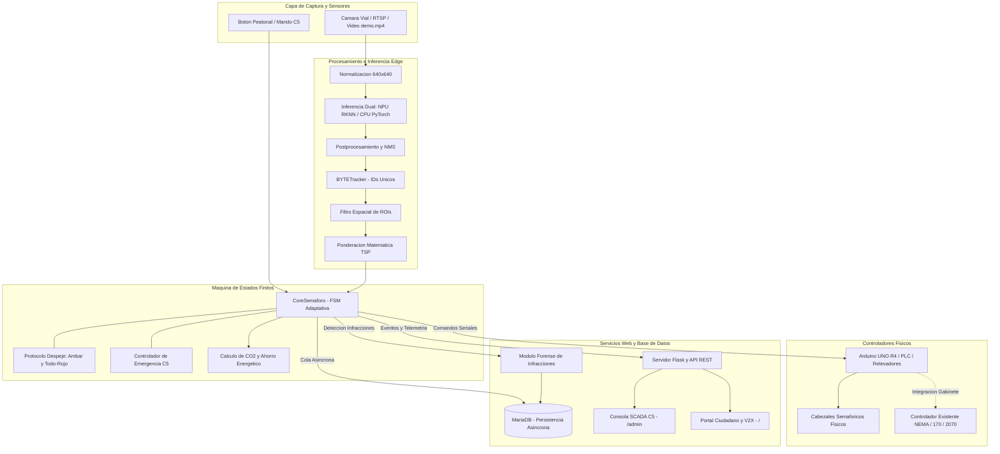
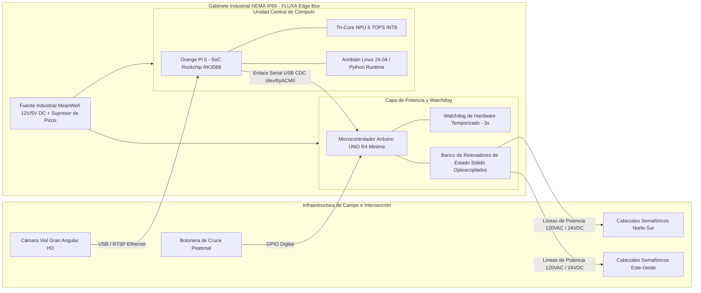
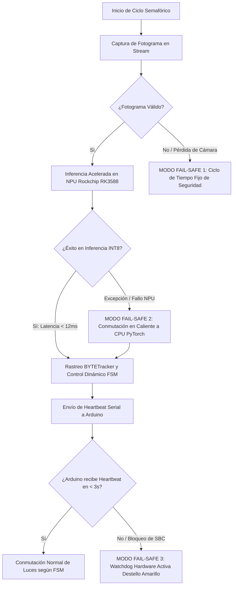
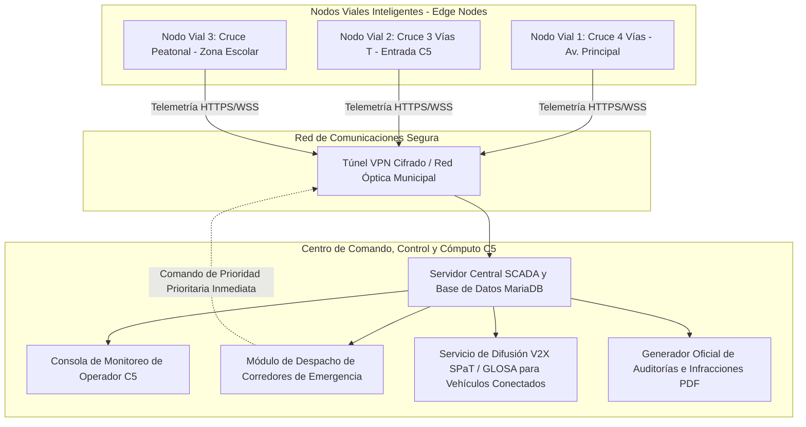

# FLUXA Smart Mobility: Manual Técnico y Guía de Arquitectura

**Plataforma de Control Semafórico Inteligente, Telemetría Edge AI y Gestión de Movilidad Urbana**  
*Tecnológico de Estudios Superiores de Coacalco (TESCo) • División de Ingeniería en Sistemas Computacionales*  
*Tecnológico Nacional de México (TecNM) • Desarrollador Principal: Moisés Emilio Martínez Arias*

---

## 1. Resumen Ejecutivo y Ficha Técnica

FLUXA es una plataforma industrial de **Inteligencia y Orquestación Edge para Tráfico Urbano** basada en **Visión por Computadora, Inteligencia Artificial en el Borde (*Edge AI*) y Microcontroladores**. Diseñada como una capa inteligente (*Overlay Controller*) compatible con gabinetes y controladores normativos (NEMA TS2, 170/2070 o relevadores directos), moderniza intersecciones viales sin requerir reemplazos masivos de infraestructura física.

El sistema sustituye los ciclos semafóricos tradicionales de tiempo fijo por un control dinámico basado en demanda vehicular ponderada (TSP), protocolos seguros de despeje vial (Ámbar + Todo-Rojo), mitigación de emisiones contaminantes y prioridad de emergencias C5.

### Ficha de Especificaciones del Sistema

| Parámetro | Especificación / Valor |
| :--- | :--- |
| **Modelos de Detección** | YOLOv8 (Variantes: Nano `yolov8n` [3.2M], Small `yolov8s` [11.2M], Medium `yolov8m` [25.9M]) |
| **Aceleración Hardware NPU** | **Exclusiva en Orange Pi 5 (RK3588)** sobre **Armbian Linux** (3 núcleos NPU, 6 TOPS, modelos `.rknn` INT8) |
| **Inferencia en Sistemas x86_64** | **CPU PyTorch Nativo** sobre **openSUSE, Ubuntu, Debian, Fedora** (modelo estándar `yolov8n.pt`) |
| **Algoritmo de Rastreo** | BYTETracker con Filtro de Kalman y asociación espacial de centroides |
| **Tolerancia a Fallos (Fail-Safe)** | Conmutación automática en caliente de NPU a CPU (PyTorch) ante cualquier contingencia |
| **Latencia de Inferencia** | **< 12 ms** (NPU RK3588 en Armbian) / **~25-45 ms** (CPU x86_64 con `yolov8n.pt`) |
| **Tasa de Procesamiento (FPS)** | 25 - 60 FPS continuos en Edge Appliance |
| **Controlador de Potencia** | Arduino UNO R4 Minima / Microcontrolador Industrial / PLC con Watchdog Serial |
| **Base de Datos** | MariaDB 10.11+ / MySQL 8.0+ con motor InnoDB, cola asíncrona y búfer local |
| **Servidor Web y Streaming** | Flask 3.x con hilos nativos, streaming multipart MJPEG y control de acceso seguro |
| **Protocolo V2X** | SPaT (*Signal Phase and Timing*) y GLOSA (*Green Light Optimal Speed Advisory*) |

> [!NOTE]
> **Segmentación de Motores de Inferencia:**
> 1. **Entornos Edge Appliance (Orange Pi 5 • Armbian 24.04):** Diseñados para operar con el motor `core_semaforo_rknn.py` (`rknnlite`), consumiendo modelos `.rknn` pre-cuantizados a INT8 para mínima latencia térmica y energética.
> 2. **Estaciones de Desarrollo y Servidores (x86_64 • openSUSE, Ubuntu, Fedora, Debian):** Operan mediante el motor `core_semaforo.py` y `ui*_cpu.py` (`ultralytics`), utilizando el modelo estándar `yolov8n.pt` procesado por la CPU sin requerir aceleradores de hardware dedicados.

---

## 2. Arquitectura de Ingeniería del Sistema

### 2.1. Diagrama de Flujo de Software y Pipeline de Inferencia



### 2.2. Arquitectura de Hardware e Integración en Gabinete Vial (*Edge Appliance*)



### 2.3. Diagrama de Tolerancia a Fallos y Conmutación en Caliente (*Fail-Safe Matrix*)



### 2.4. Topología de Red y Centro de Mando Centralizado C5 / V2X



---

## 3. Catálogo Integral de Capacidades, Funcionalidades y Facilidades del Sistema

FLUXA integra un conjunto de capacidades de ingeniería diseñadas para maximizar el rendimiento, la seguridad vial, la resiliencia operativa y la interoperabilidad en entornos urbanos inteligentes (*Smart Cities*):

```
┌────────────────────────────────────────────────────────────────────────────────────────┐
│                     MATRIZ DE CAPACIDADES Y FACILIDADES DE FLUXA                       │
├──────────────────────────┬──────────────────────────┬──────────────────────────────────┤
│ ÁREA DE INGENIERÍA       │ CAPACIDAD TÉCNICA        │ IMPACTO / BENEFICIO OPERATIVO    │
├──────────────────────────┼──────────────────────────┼──────────────────────────────────┤
│ Visión Edge & NPU        │ YOLOv8 INT8 (Tri-Core)   │ Inferencia < 12ms a 30-60 FPS    │
│ Rastreo Espaciotemporal  │ BYTETracker + Kalman     │ IDs únicos persistentes por auto │
│ Control Adaptativo       │ FSM Dinámica + TSP       │ Verde 5s-45s según carga real    │
│ Seguridad Vial           │ Despeje Ámbar/Todo-Rojo  │ Cero conflictos vehiculares      │
│ Alta Disponibilidad      │ Fail-Safe Tri-Nivel      │ Conmutación NPU->CPU y Watchdog  │
│ Fiscalización Forense    │ Detección en Luz Roja    │ Fotos con metadatos y cuota FIFO │
│ Centro de Mando C5       │ Web SCADA + MJPEG Stream │ Control de Emergencia y Diagnóst.│
│ Calibración Óptica       │ ROI Canvas Studio        │ Ajuste visual de carriles en web │
│ Sustentabilidad Urbana   │ Motor de CO2 y Gasolina  │ Cálculo de huella en tiempo real │
│ Telemetría V2X           │ Protocolos SPaT y GLOSA  │ Enlace a vehículos conectados    │
│ Auditoría Oficial        │ Generador PDF Certificado│ Informes ejecutivos imprimibles  │
│ Despliegue Universal     │ Script install.sh + DOCKER│ Armbian, openSUSE, Fedora, Ubuntu│
└──────────────────────────┴──────────────────────────┴──────────────────────────────────┘
```

### 3.1. Capacidades de Visión por Computadora e Inteligencia Artificial en el Borde
1. **Inferencia Acelerada en NPU Rockchip RK3588:** Ejecución nativa sobre 3 núcleos de NPU (6 TOPS) consumiendo modelos YOLOv8 cuantizados en formato asimétrico **INT8** (`.rknn`), alcanzando latencias de inferencia de **~3.4 a 10.8 ms** con un consumo energético menor a 15W.
2. **Detección Multiclase Vehicular y Peatonal:** Reconocimiento simultáneo de 6 clases de interés vial: automóviles particulares, autobuses de transporte público, camiones de carga pesada, motocicletas, bicicletas y peatones.
3. **Rastreo Multiobjeto con BYTETracker:** Seguimiento espaciotemporal continuo mediante Filtro de Kalman y asociación húngara de centroides, asignando identificadores numéricos únicos (*Track IDs*) que evitan el doble conteo de vehículos en oclusión o tráfico detenido.
4. **Cuantificación de Colas por Regiones de Interés (ROIs):** Algoritmo de punto en polígono (*Ray Casting*) para delimitar carriles individuales de aproximación y calcular la longitud de cola en tiempo real.

### 3.2. Capacidades de Control Semafórico Adaptativo y Priorización Vial
1. **Asignación Dinámica del Tiempo de Verde:** Ajuste en tiempo real de la duración de la fase verde (entre un mínimo $T_{\text{min}} = 5\,\text{s}$ y un máximo $T_{\text{max}} = 45\,\text{s}$) proporcional a la demanda vehicular real de la intersección.
2. **Priorización de Transporte Público (TSP - Transit Signal Priority):** Ponderación matemática que multiplica el peso de autobuses ($4.0\times$) y camiones ($2.5\times$) sobre vehículos particulares ($1.0\times$), acelerando el paso de pasajeros en corredores masivos.
3. **Protocolo Normativo de Despeje Vial:** Transición obligatoria e ininterrumpible que inserta $3.0\,\text{s}$ de Ámbar seguidos de $2.0\,\text{s}$ de Todo-Rojo (*All-Red Clearance*) antes de conmutar a la fase verde contraria, eliminando riesgos de colisión por cruces intempestivos.
4. **Salto Inteligente de Fases Vacías (*Phase-Skipping*):** En topologías con giros protegidos a la izquierda, si el carril de vuelta no registra vehículos en cola, la FSM omite la fase de flecha y pasa directamente al verde continuo, reduciendo demoras innecesarias.
5. **Catálogo de 5 Topologías Urbanas Nativas:** Soporte nativo para 4 Vías Clásica (`4_way`), 2 Vías / Avenida (`2_way`), 3 Vías Tipo T (`3_way_t`), Giro Protegido (`4_way_protected`) y Cruce Peatonal Mid-Block (`pedestrian`).

### 3.3. Facilidades de Alta Disponibilidad y Resiliencia Industrial (*Fail-Safe Matrix*)
1. **Conmutación en Caliente NPU $\to$ CPU:** Si el runtime de la NPU (`rknnlite`) o el controlador del acelerador experimentan una contingencia, el sistema conmuta instantáneamente al motor PyTorch en CPU (`yolov8n.pt`) sin congelar el flujo ni apagar las luces.
2. **Watchdog de Hardware Temporizado en Microcontrolador:** Circuito de vigilancia en Arduino UNO R4 que recibe un *heartbeat* serial cada ciclo. Si el procesador principal se congela o la cámara se desconecta por más de $3.0\,\text{s}$, el microcontrolador toma el control autónomo e inicia un ciclo de seguridad aislado de tiempo fijo ($20\,\text{s}$).
3. **Aislamiento Galvánico por Relevadores de Estado Sólido (SSR):** Protección eléctrica de circuitos de baja tensión ($5\,\text{V} / 3.3\,\text{V}$) contra transitorios y sobretensiones de la red de potencia semafórica ($120\,\text{VAC} / 24\,\text{VDC}$).
4. **Reconexión Serial en Caliente:** Hilo en segundo plano que reintenta la comunicación física en `/dev/ttyACM*` o `/dev/ttyUSB*` sin detener el servidor web ni la inferencia de IA.

### 3.4. Facilidades del Módulo Forense de Infracciones en Luz Roja
1. **Detección Automática de Infracciones:** Validación espaciotemporal en tiempo real cuando el centroide de un vehículo en movimiento cruza la línea de paro durante el estado de luz roja del carril conflictivo.
2. **Captura Fotográfica de Evidencia:** Generación automática de archivo JPEG de alta resolución con marca de tiempo, ID del vehículo, carril de infracción y estado de la fase semafórica.
3. **Gestión de Almacenamiento Circular FIFO:** Política automática de retención con límites configurables (por defecto 300 capturas y $150\,\text{MB}$ máximo) que purga las imágenes más antiguas para proteger la memoria flash eMMC/NVMe del dispositivo en campo.
4. **Consulta y Descarga Forense en SCADA:** Interfaz dedicada en el panel administrativo para visualizar el registro de infracciones con enlaces directos a las imágenes de evidencia.

### 3.5. Facilidades del Centro de Mando Web SCADA C5
1. **Transmisión de Video en Vivo de Baja Latencia:** Streaming multipart MJPEG (`/video_feed`) optimizado para redes locales y VPNs con baja sobrecarga de procesamiento.
2. **Mando de Corredor de Emergencia C5:** Botón prioritario en interfaz que permite al operador forzar la apertura de verde inmediato para ambulancias o convoyes policiales, ejecutando primero el despeje de seguridad normado.
3. **Calibrador Visual de Regiones de Interés (ROI Canvas Studio):** Herramienta interactiva en JavaScript/Canvas HTML5 que permite a los técnicos arrastrar y redimensionar los polígonos de aforo directamente sobre el fotograma en vivo sin necesidad de editar archivos JSON manualmente.
4. **HUD de Diagnóstico de Hardware:** Monitorización en tiempo real del porcentaje de uso de CPU, temperatura del SoC en grados Celsius ($^\circ\text{C}$), uso de memoria RAM, espacio libre en disco raíz y estado activo de los núcleos NPU.
5. **Seguridad y Control de Sesiones:** Autenticación robusta basada en hashes PBKDF2-SHA256 con salt dinámico, cookies de sesión con directivas `HttpOnly` y `SameSite=Lax`, y protección contra fuerza bruta.

### 3.6. Facilidades de Transparencia Ciudadana, Sustentabilidad y Telemetría V2X
1. **Portal Ciudadano Abierto (`/`):** Vista pública responsive sin autenticación que democratiza el estado de la intersección, conteos de aforo y métricas de fluidez vial.
2. **Calculadora de Impacto Ambiental en Tiempo Real:** Algoritmo que cuantifica segundo a segundo los litros de combustible ahorrados y los kilogramos de $\text{CO}_2$ mitigados al reducir los tiempos de ralentí (*idling*) de los vehículos en espera.
3. **Telemetría Vehicular V2X (SPaT y GLOSA):** Emisión continua de mensajes en formato JSON estándar (`/api/v2x/spat`) que informan la fase semafórica actual, el tiempo exacto restante en segundos y la velocidad óptima de aproximación aconsejada (*Green Light Optimal Speed Advisory*).
4. **Generador Oficial de Informes Ejecutivos en PDF:** Generación instantánea de dictámenes de auditoría vial imprimibles (`/report/executive`) con código criptográfico de verificación, análisis de hora pico y métricas de desempeño para dependencias de gobierno.

### 3.7. Facilidades de Despliegue, Infraestructura y Portabilidad
1. **Instalador Universal Automatizado (`install.sh`):** Detección automática de distribuciones Linux (**Armbian 24.04, openSUSE Tumbleweed/Leap/SLES, Fedora/RHEL, Ubuntu, Debian**) e instalación desatendida de dependencias, MariaDB, entorno virtual y reglas udev.
2. **Servicio Systemd Autogestionado:** Creación dinámica del servicio `/etc/systemd/system/fluxa.service` con selección automática de backend según arquitectura (`--backend rknn` en ARM64, `--backend cpu` en x86_64), auto-reinicio ante fallas y control centralizado mediante `journalctl`.
3. **Persistencia Híbrida Asíncrona:** Base de datos MariaDB desacoplada mediante cola en memoria (`queue.Queue`) con conmutación transparente a búfer local si se interrumpe la conexión al servidor de base de datos.
4. **Contenedorización Oficial:** Archivos `Dockerfile` y `docker-compose.yml` listos para despliegue en infraestructuras Docker y Podman.

---

## 4. Modelado Matemático y Algoritmos de Control

### 4.1. Prioridad de Transporte Público (TSP - Transit Signal Priority)
En lugar de basarse en conteos simples de vehículos, FLUXA calcula la Demanda Ponderada ($D_j$) para cada carril $j$:

$$D_j = \sum_{k} w_k \cdot N_{j,k}$$

Donde:
* $N_{j,k}$ es el número de vehículos de la clase $k$ detectados dentro del polígono del carril $j$.
* $w_k$ es el factor de peso asignado según el impacto en movilidad urbana:
  * **Autobús de pasajeros (Clase COCO 5):** $w_5 = 4.0$
  * **Camión de carga / Transporte pesado (Clase COCO 7):** $w_7 = 2.5$
  * **Peatón (Clase COCO 0):** $w_0 = 1.5$
  * **Automóvil particular (Clase COCO 2):** $w_2 = 1.0$
  * **Bicicleta (Clase COCO 1):** $w_1 = 0.8$
  * **Motocicleta (Clase COCO 3):** $w_3 = 0.6$

### 4.2. Asignación Dinámica del Tiempo de Verde
El tiempo asignado a la fase verde activa ($T_{\text{verde}}$) se calcula dinámicamente mediante una función acotada:

$$T_{\text{verde}} = \min\left(T_{\text{max}}, \max\left(T_{\text{min}}, T_{\text{min}} + f \cdot \max(D_j)\right)\right)$$

Donde:
* $T_{\text{min}}$: Tiempo mínimo de verde garantizado (por defecto: $5.0\,\text{s}$).
* $T_{\text{max}}$: Tiempo máximo límite de verde (por defecto: $45.0\,\text{s}$).
* $f$: Factor de segundos por auto equivalente (por defecto: $2.5\,\text{s/auto}$).

### 4.3. Modelo de Impacto Ecológico y Ahorro de Emisiones
Para estimar el combustible y emisiones mitigadas en tiempo real frente a un ciclo de tiempo fijo de referencia ($T_{\text{fijo}} = 45\,\text{s}$):

1. **Segundos de Espera Ahorrados en el Ciclo ($\Delta t_{\text{espera}}$):**
   $$\Delta t_{\text{espera}} = \max\left(0, T_{\text{fijo}} - T_{\text{verde}}\right) \cdot N_{\text{espera}}$$

2. **Litros de Combustible Ahorrados ($V_{\text{combustible}}$):**
   Considerando una tasa promedio de consumo de $0.8\,\text{litros/hora}$ en ralentí (*idle*):
   $$V_{\text{combustible}} = \Delta t_{\text{espera}} \cdot \left(\frac{0.8}{3600}\right)$$

3. **Kilogramos de CO₂ Mitigados ($M_{\text{CO2}}$):**
   Utilizando el factor de emisión estándar de $2.31\,\text{kg de CO}_2$ por litro de gasolina no quemado:
   $$M_{\text{CO2}} = V_{\text{combustible}} \cdot 2.31$$

### 4.4. Detección Espaciotemporal de Infracciones en Luz Roja
1. Se obtiene el estado semafórico activo (por ejemplo: `VERDE_NS`, `AMARILLO_NS`, `VERDE_EO`, `ROJO_TODOS`).
2. Para cada vehículo rastreado con identificador $ID_i$ y centroide $(c_x, c_y)$:
   $$\text{Infraccion} \iff (c_x, c_y) \in \text{ROI}(\text{Carril}_j) \land \text{Fase}(\text{Carril}_j) = \text{ROJO}$$
3. Para evitar duplicados en el mismo ciclo, se registra la tupla de clave única en memoria y se dispara la captura fotográfica con rotación FIFO.

---

## 5. Integración con Hardware y Microcontrolador

### 5.1. Conexión Serial con Arduino UNO R4 Minima
* **Puerto Predeterminado:** `/dev/ttyACM0` (con escaneo automático en `/dev/ttyACM*` y `/dev/ttyUSB*`).
* **Parámetros Seriales:** `9600 baudios, 8 bits de datos, sin paridad, 1 bit de parada (8N1)`.
* **Watchdog de Reconexión:** El hilo `_init_arduino` ejecuta reintentos periódicos en caso de desconexión accidental del cable USB sin detener la operación de la IA.

### 5.2. Mapa de Comandos y Pines Físicos

| Comando ASCII | Estado Activado | Salida Arduino | Semáforo Eje NS | Semáforo Eje EO |
| :---: | :--- | :---: | :---: | :---: |
| `'1'` | **VERDE NS** | Pin D2 (Verde NS), Pin D7 (Rojo EO) | Verde | Rojo |
| `'2'` | **AMARILLO NS** | Pin D3 (Amarillo NS), Pin D7 (Rojo EO) | Amarillo | Rojo |
| `'3'` | **VERDE EO** | Pin D4 (Rojo NS), Pin D5 (Verde EO) | Rojo | Verde |
| `'4'` | **AMARILLO EO** | Pin D4 (Rojo NS), Pin D6 (Amarillo EO) | Rojo | Amarillo |
| `'0'` | **ROJO TOTAL** | Pin D4 (Rojo NS), Pin D7 (Rojo EO) | Rojo | Rojo |

---

## 6. Plataforma WebUI, Centro de Mando SCADA C5 y API REST

El subsistema de interfaces web de **FLUXA** está construido sobre un servidor ligero nativo en **Flask 3.x** con ejecución multihilo. El sistema no requiere la instalación de aplicaciones cliente propietarias: se opera íntegramente desde cualquier navegador moderno mediante estándares web abiertos (**HTML5, Vanilla CSS3, Canvas API y JavaScript ES6+**):

* **Dirección de Acceso por Defecto:** `http://localhost:5000` o `http://<IP_ORANGE_PI>:5000`
* **Puerto de Servicio:** `5000` (personalizable por CLI o archivo de configuración).

```
                              ┌─────────────────────────────────────────────────────────┐
                              │            SERVIDOR WEB FLUXA (PUERTO 5000)             │
                              └────────────────────────────┬────────────────────────────┘
                                                           │
                      ┌────────────────────────────────────┴────────────────────────────────────┐
                      ▼                                                                         ▼
   ┌─────────────────────────────────────┐                                   ┌─────────────────────────────────────┐
   │    PORTAL CIUDADANO ABIERTO ( / )   │                                   │     PORTAL DE ACCESO C5 ( /login )  │
   ├─────────────────────────────────────┤                                   ├─────────────────────────────────────┤
   │ • Estado del Semáforo en Tiempo Real│                                   │ • Autenticación Criptográfica       │
   │ • Conteo de Aforo por Carril en Vivo│                                   │ • Cifrado PBKDF2-SHA256             │
   │ • Calculadora de Ahorro de Gasolina │                                   │ • Control de Sesión HttpOnly        │
   │ • Mitigación de CO2 en Vivo         │                                   └──────────────────┬──────────────────┘
   │ • Telemetría V2X SPaT / GLOSA       │                                                      │ (Acceso Autorizado)
   └─────────────────────────────────────┘                                                      ▼
                                                                             ┌─────────────────────────────────────┐
                                                                             │   CENTRO DE MANDO SCADA C5 (/admin) │
                                                                             ├─────────────────────────────────────┤
                                                                             │ [1] Streaming MJPEG con Bounding Box│
                                                                             │ [2] Botón de Corredor de Emergencia │
                                                                             │ [3] Calibrador Visual ROI Canvas    │
                                                                             │ [4] Módulo Forense de Infracciones  │
                                                                             │ [5] Diagnóstico de Hardware Edge    │
                                                                             │ [6] Conmutador de Modelos y Cámaras │
                                                                             │ [7] Generador de Auditoría en PDF   │
                                                                             └─────────────────────────────────────┘
```

### 6.1. Portal Ciudadano y Transparencia en Tiempo Real (`/`)
Accesible de forma pública sin credenciales:
* **Semáforo Sincronizado en Vivo:** Elementos SVG/CSS que reproducen visualmente la conmutación de las luces de la calle con cuenta regresiva en segundos.
* **Aforo por Carril:** Contadores en tiempo real de automóviles, autobuses y peatones procesados por la NPU.
* **Monitoreo de Sustentabilidad:** Panel dinámico que calcula los litros de gasolina no consumidos y los kilogramos de $\text{CO}_2$ evitados en la intersección.
* **Asesor de Velocidad Óptima (GLOSA):** Indicador de velocidad sugerida para que los vehículos conectados alcancen la siguiente luz verde sin detenerse.

### 6.2. Módulos Interactivos de la Consola SCADA C5 (`/admin`)
Panel central protegido por autenticación PBKDF2-SHA256 con las siguientes herramientas operativas:

1. **Streaming MJPEG de Inferencia en Directo:** Visualización del flujo de video procesado con las cajas delimitadoras de YOLOv8, etiquetas de clase, identificadores de seguimiento único (*Track IDs*) de BYTETracker y polígonos de carril superpuestos.
2. **Despacho de Corredor de Emergencia C5:** Botón para habilitar la onda verde prioritaria ante el paso de ambulancias, bomberos o convoyes de seguridad, ejecutando los intervalos de despeje Ámbar y Todo-Rojo normados.
3. **Calibrador Visual de Regiones de Interés (ROI Canvas Studio):** Editor interactivo en JavaScript que permite a los técnicos arrastrar y redimensionar los vértices de los polígonos de detección directamente sobre un fotograma congelado, aplicando los cambios en caliente (`POST /api/config/full`).
4. **Módulo Forense de Infracciones:** Pestaña con historial de vehículos que cruzaron en luz roja, con visor de imágenes JPEG de evidencia, metadatos y opción de descarga.
5. **HUD de Diagnóstico de Hardware:** Monitorización en tiempo real del uso de CPU, temperatura del chip RK3588 en $^\circ\text{C}$, memoria RAM y estado de los 3 núcleos de NPU.
6. **Conmutación en Caliente de Cámaras y Modelos:** Selectores para alternar en tiempo de ejecución entre cámaras físicas (V4L2, MIPI CSI, RTSP) y videos demo, o cambiar modelos neuronales.
7. **Emisión de Dictámenes Oficiales en PDF:** Generador del Informe Ejecutivo de Auditoría Vial (`/report/executive`) con código criptográfico de verificación, listo para imprimir (`Ctrl + P`).

### 6.3. Catálogo de Endpoints de la API REST

#### Autenticación y Control de Acceso
* `POST /api/auth/login`: `{ "username": "admin", "password": "..." }` $\to$ Validación con hash PBKDF2-SHA256 y cookie de sesión `HttpOnly`.
* `POST /api/auth/logout`: Invalida la sesión activa del operador.
* `GET /api/auth/check`: Retorna el estado de autenticación `{ "authenticated": true, "user": "admin" }`.

#### Telemetría y Transmisión de Video
* `GET /video_feed`: Flujo continuo de video multipart MJPEG (`Content-Type: multipart/x-mixed-replace`).
* `GET /api/frame/snapshot`: Fotograma JPEG congelado para el editor gráfico en Canvas.
* `GET /api/status`: Estado integral del sistema (fase activa, aforo por carril, métricas de hardware, latencias).
* `GET /api/v2x/spat`: Mensaje SPaT con fase actual, tiempo restante y velocidad aconsejada.
* `GET /api/kpis/sustainability`: Métricas acumuladas de ahorro de combustible, CO₂ y tiempo.
* `GET /api/history`: Muestras temporales para gráficas de flujo vehicular en tiempo real.
* `GET /api/reports/summary?date=YYYY-MM-DD`: Análisis de hora pico y volumen vehicular del día.

#### Control y Configuración (Operador C5)
* `POST /api/control`: `{ "action": "emergency_corridor", "target": "NS" }` $\to$ Activa corredor verde C5.
* `GET /api/config/full` / `POST /api/config/full`: Consulta y actualización en caliente de polígonos y tiempos.
* `GET /api/models/list` / `POST /api/models/set`: Lista y conmuta el modelo YOLO en memoria.
* `GET /api/video_source/list` / `POST /api/video_source/set`: Conmuta entre cámaras físicas y videos de prueba.
* `GET /api/violations`: Consulta de registros de infracciones con enlaces a evidencia fotográfica.
* `GET /api/violations/snapshot/<filename>`: Descarga o visualización de foto de evidencia.

---

## 7. Esquema de Base de Datos MariaDB (`fluxa_traffic`)

```sql
CREATE DATABASE IF NOT EXISTS fluxa_traffic CHARACTER SET utf8mb4 COLLATE utf8mb4_unicode_ci;
USE fluxa_traffic;

-- 1. Telemetría periódica de tráfico y hardware
CREATE TABLE IF NOT EXISTS traffic_telemetry (
    id BIGINT AUTO_INCREMENT PRIMARY KEY,
    timestamp DATETIME NOT NULL,
    topology VARCHAR(50) NOT NULL,
    active_phase VARCHAR(50) NOT NULL,
    total_cars INT NOT NULL,
    lane_counts_json TEXT NOT NULL,
    weighted_demand FLOAT NOT NULL,
    cpu_percent FLOAT,
    cpu_temp_c FLOAT,
    ram_percent FLOAT,
    fps FLOAT,
    INDEX idx_time (timestamp)
) ENGINE=InnoDB;

-- 2. Registro de eventos y auditoría del sistema
CREATE TABLE IF NOT EXISTS system_events (
    id BIGINT AUTO_INCREMENT PRIMARY KEY,
    timestamp DATETIME NOT NULL,
    event_type VARCHAR(20) NOT NULL,
    message VARCHAR(255) NOT NULL,
    INDEX idx_time (timestamp)
) ENGINE=InnoDB;

-- 3. Registro de infracciones por cruce en luz roja
CREATE TABLE IF NOT EXISTS red_light_violations (
    id BIGINT AUTO_INCREMENT PRIMARY KEY,
    timestamp DATETIME NOT NULL,
    lane VARCHAR(50) NOT NULL,
    track_id INT NOT NULL,
    phase_state VARCHAR(50) NOT NULL,
    snapshot_path VARCHAR(255),
    INDEX idx_time (timestamp)
) ENGINE=InnoDB;
```

---

## 8. Despliegue en Producción e Infraestructura

### 8.1. Instalador Universal Nativo (`install.sh`)
Diseñado para operar sobre **Orange Pi 5 (Armbian / Debian aarch64)** y **estaciones de trabajo / servidores (openSUSE Tumbleweed/Leap/SLES, Fedora, RHEL, Ubuntu x86_64)**:

```bash
cd fluxa-smart-city
bash install.sh
```

El instalador:
1. Detecta la distribución Linux y la arquitectura de hardware.
2. Instala dependencias del sistema operativo (Python 3, MariaDB, librerías gráficas OpenGL/V4L2).
3. Configura reglas de hardware (`/etc/udev/rules.d/99-fluxa-hardware.rules`) para Arduino, cámaras y NPU.
4. Despliega un entorno virtual aislado `.venv` e instala las librerías de IA y tracking.
5. Inicializa MariaDB solicitando de forma interactiva la contraseña o generando una cadena segura en `.env`.
6. Solicita y almacena las credenciales de operador C5 mediante hash seguro en `instance/admin_credentials.json`.
7. Instala el comando global `/usr/local/bin/fluxa` y registra la unidad de servicio `systemd`.

### 8.2. Desinstalación Limpia (`uninstall.sh`)
```bash
bash uninstall.sh
```
Detiene y remueve el servicio `systemd`, borra el acceso global `/usr/local/bin/fluxa` y permite purgar opcionalmente el entorno virtual, las credenciales locales y la base de datos MariaDB.

### 8.3. Despliegue en Contenedores (Docker / Podman)
```bash
docker compose up -d
docker compose logs -f
```

---

## 9. Seguridad Perimetral, Protección de Modelos y Licenciamiento Comercial

### 9.1. Protección del Runtime en Hardware Edge
1. **Modelos Compilados en Formato Binario:** Las redes neuronales se distribuyen en formato cuantizado INT8 binario (`.rknn`), evitando la exposición de hiperparámetros y pesos en texto plano o estructuras desprotegidas.
2. **Cifrado de Credenciales C5:** Almacenamiento local mediante hashes criptográficos PBKDF2-SHA256 con salt dinámico y endurecimiento de cookies HTTPOnly / SameSite.
3. **Persistencia Híbrida y Blindaje de Red:** Cola asíncrona no bloqueante en MariaDB con aislamiento en red local y conmutación transparente a búfer en memoria ante pérdidas de enlace.

### 9.2. Régimen de Propiedad Intelectual
* **Titularidad:** Moisés Emilio Martínez Arias © 2026. Todos los derechos reservados.
* **Respaldo Institucional:** Tecnológico de Estudios Superiores de Coacalco (TESCo) • Tecnológico Nacional de México (TecNM).
* **Marco Legal:** Consulte el contrato de licenciamiento en [LICENSE.md](../LICENSE.md) y la justificación económica en [Modelo de Negocio B2G y ROI](MODELO_NEGOCIO_B2G.md).
