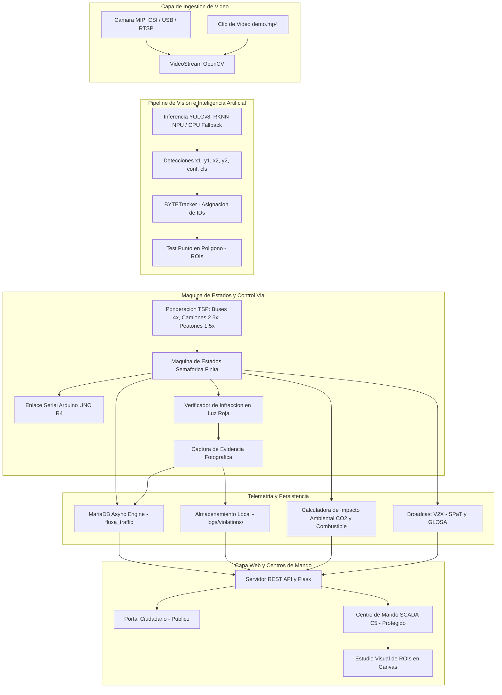

# FLUXA Smart Mobility: Manual Técnico y Guía de Arquitectura

**Plataforma de Control Semafórico Inteligente, Telemetría Edge AI y Gestión de Movilidad Urbana**  
*Tecnológico de Estudios Superiores de Coacalco (TESCo) • División de Ingeniería en Sistemas Computacionales*  
*Tecnológico Nacional de México (TecNM) • Desarrollador Principal: Moisés Emilio Martínez Arias*

---

## 1. Resumen Ejecutivo y Ficha Técnica

FLUXA es una plataforma industrial de **Inteligencia y Orquestación Edge para Tráfico Urbano** basada en **Visión por Computadora, Inteligencia Artificial en el Borde (*Edge AI*) y Microcontroladores**. Diseñada como una capa inteligente (*Overlay Controller*) compatible con gabinetes y controladores normativos (NEMA TS2, 170/2070 o relevadores directos), moderniza intersecciones viales sin requerir reemplazos masivos de infraestructura física.

El sistema sustituye los ciclos semafóricos tradicionales de tiempo fijo por un control dinámico basado en demanda vehicular ponderada (TSP), protocolos seguros de despeje vial (Ámbar + Todo-Rojo), mitigación de emisiones contaminantes y prioridad de emergencias C5.

### Ficha de Especificaciones del Sistema

| Parámetro | Especificación / Valor |
| :--- | :--- |
| **Modelos de Detección** | YOLOv8 (Variantes: Nano `3.2M`, Small `11.2M`, Medium `25.9M`) |
| **Algoritmo de Rastreo** | BYTETracker con Filtro de Kalman y asociación espacial de centroides |
| **Aceleración Hardware Edge** | Rockchip RK3588 NPU (3 núcleos, 6 TOPS, cuantización INT8 asimétrica) |
| **Tolerancia a Fallos (Fail-Safe)** | Conmutación automática en caliente de NPU a CPU (PyTorch) ante fallas |
| **Latencia de Inferencia** | **< 12 ms** (NPU RK3588) / **~35-45 ms** (CPU x86/ARM64) |
| **Tasa de Procesamiento (FPS)** | 25 - 60 FPS continuos en Edge |
| **Controlador de Potencia** | Arduino UNO R4 Minima / Microcontrolador Industrial / PLC con Watchdog Serial |
| **Base de Datos** | MariaDB 10.11+ / MySQL 8.0+ con motor InnoDB, cola asíncrona y búfer local |
| **Servidor Web y Streaming** | Flask 3.x con hilos nativos, streaming multipart MJPEG y control de acceso seguro |
| **Protocolo V2X** | SPaT (*Signal Phase and Timing*) y GLOSA (*Green Light Optimal Speed Advisory*) |

---

## 2. Arquitectura Global del Sistema



---

## 3. Modelado Matemático y Algoritmos de Control

### 3.1. Prioridad de Transporte Público (TSP - Transit Signal Priority)
En lugar de basarse en conteos simples de vehículos, FLUXA calcula la Demanda Ponderada ($D_j$) para cada carril $j$:

$$D_j = \sum_{k} w_k \cdot N_{j,k}$$

Donde:
* $N_{j,k}$ es el número de vehículos de la clase $k$ detectados dentro del polígono del carril $j$.
* $w_k$ es el factor de peso asignado según el impacto en movilidad urbana:
  * **Autobús de pasajeros (Clase COCO 5):** $w_5 = 4.0$
  * **Camión de carga / Transporte pesado (Clase COCO 7):** $w_7 = 2.5$
  * **Peatón (Clase COCO 0):** $w_0 = 1.5$
  * **Automóvil particular (Clase COCO 2):** $w_2 = 1.0$
  * **Bicicleta (Clase COCO 1):** $w_1 = 0.8$
  * **Motocicleta (Clase COCO 3):** $w_3 = 0.6$

### 3.2. Asignación Dinámica del Tiempo de Verde
El tiempo asignado a la fase verde activa ($T_{\text{verde}}$) se calcula dinámicamente mediante una función acotada:

$$T_{\text{verde}} = \min\left(T_{\text{max}}, \max\left(T_{\text{min}}, T_{\text{min}} + f \cdot \max(D_j)\right)\right)$$

Donde:
* $T_{\text{min}}$: Tiempo mínimo de verde garantizado (por defecto: $5.0\,\text{s}$).
* $T_{\text{max}}$: Tiempo máximo límite de verde (por defecto: $45.0\,\text{s}$).
* $f$: Factor de segundos por auto equivalente (por defecto: $2.5\,\text{s/auto}$).

### 3.3. Modelo de Impacto Ecológico y Ahorro de Emisiones
Para estimar el combustible y emisiones mitigadas en tiempo real frente a un ciclo de tiempo fijo de referencia ($T_{\text{fijo}} = 45\,\text{s}$):

1. **Segundos de Espera Ahorrados en el Ciclo ($\Delta t_{\text{espera}}$):**
   $$\Delta t_{\text{espera}} = \max\left(0, T_{\text{fijo}} - T_{\text{verde}}\right) \cdot N_{\text{espera}}$$

2. **Litros de Combustible Ahorrados ($V_{\text{combustible}}$):**
   Considerando una tasa promedio de consumo de $0.8\,\text{litros/hora}$ en ralentí (*idle*):
   $$V_{\text{combustible}} = \Delta t_{\text{espera}} \cdot \left(\frac{0.8}{3600}\right)$$

3. **Kilogramos de CO₂ Mitigados ($M_{\text{CO2}}$):**
   Utilizando el factor de emisión estándar de $2.31\,\text{kg de CO}_2$ por litro de gasolina no quemado:
   $$M_{\text{CO2}} = V_{\text{combustible}} \cdot 2.31$$

### 3.4. Detección Espaciotemporal de Infracciones en Luz Roja
1. Se obtiene el estado semafórico activo (por ejemplo: `VERDE_NS`, `AMARILLO_NS`, `VERDE_EO`, `ROJO_TODOS`).
2. Para cada vehículo rastreado con identificador $ID_i$ y centroide $(c_x, c_y)$:
   $$\text{Infraccion} \iff (c_x, c_y) \in \text{ROI}(\text{Carril}_j) \land \text{Fase}(\text{Carril}_j) = \text{ROJO}$$
3. Para evitar duplicados en el mismo ciclo, se registra la tupla de clave única en memoria y se dispara la captura fotográfica con rotación FIFO.

---

## 4. Integración con Hardware y Microcontrolador

### 4.1. Conexión Serial con Arduino UNO R4 Minima
* **Puerto Predeterminado:** `/dev/ttyACM0` (con escaneo automático en `/dev/ttyACM*` y `/dev/ttyUSB*`).
* **Parámetros Seriales:** `9600 baudios, 8 bits de datos, sin paridad, 1 bit de parada (8N1)`.
* **Watchdog de Reconexión:** El hilo `_init_arduino` ejecuta reintentos periódicos en caso de desconexión accidental del cable USB sin detener la operación de la IA.

### 4.2. Mapa de Comandos y Pines Físicos

| Comando ASCII | Estado Activado | Salida Arduino | Semáforo Eje NS | Semáforo Eje EO |
| :---: | :--- | :---: | :---: | :---: |
| `'1'` | **VERDE NS** | Pin D2 (Verde NS), Pin D7 (Rojo EO) | Verde | Rojo |
| `'2'` | **AMARILLO NS** | Pin D3 (Amarillo NS), Pin D7 (Rojo EO) | Amarillo | Rojo |
| `'3'` | **VERDE EO** | Pin D4 (Rojo NS), Pin D5 (Verde EO) | Rojo | Verde |
| `'4'` | **AMARILLO EO** | Pin D4 (Rojo NS), Pin D6 (Amarillo EO) | Rojo | Amarillo |
| `'0'` | **ROJO TOTAL** | Pin D4 (Rojo NS), Pin D7 (Rojo EO) | Rojo | Rojo |

---

## 5. Especificación de la API REST

### Autenticación y Control de Acceso
* `POST /api/auth/login`: `{ "username": "admin", "password": "..." }` $\to$ Validación con hash PBKDF2-SHA256 y cookie de sesión.
* `POST /api/auth/logout`: Invalida la sesión activa.
* `GET /api/auth/check`: Retorna el estado de autenticación `{ "authenticated": true, "user": "admin" }`.

### Telemetría y Transmisión de Video
* `GET /video_feed`: Flujo continuo de video multipart MJPEG (`Content-Type: multipart/x-mixed-replace`).
* `GET /api/frame/snapshot`: Fotograma JPEG congelado para el editor gráfico en Canvas.
* `GET /api/status`: Estado integral del sistema (fase activa, aforo por carril, métricas de hardware, latencias).
* `GET /api/v2x/spat`: Mensaje SPaT con fase actual, tiempo restante y velocidad aconsejada.
* `GET /api/kpis/sustainability`: Métricas acumuladas de ahorro de combustible, CO₂ y tiempo.
* `GET /api/history`: Muestras temporales para gráficas de flujo vehicular en tiempo real.
* `GET /api/reports/summary?date=YYYY-MM-DD`: Análisis de hora pico y volumen vehicular del día.

### Control y Configuración (Operador C5)
* `POST /api/control`: `{ "action": "emergency_corridor", "target": "NS" }` $\to$ Activa corredor verde C5.
* `GET /api/config/full` / `POST /api/config/full`: Consulta y actualización en caliente de polígonos y tiempos.
* `GET /api/models/list` / `POST /api/models/set`: Lista y conmuta el modelo YOLO en memoria.
* `GET /api/video_source/list` / `POST /api/video_source/set`: Conmuta entre cámaras físicas y videos de prueba.
* `GET /api/violations`: Consulta de registros de infracciones con enlaces a evidencia fotográfica.
* `GET /api/violations/snapshot/<filename>`: Descarga o visualización de foto de evidencia.

---

## 6. Esquema de Base de Datos MariaDB (`fluxa_traffic`)

```sql
CREATE DATABASE IF NOT EXISTS fluxa_traffic CHARACTER SET utf8mb4 COLLATE utf8mb4_unicode_ci;
USE fluxa_traffic;

-- 1. Telemetría periódica de tráfico y hardware
CREATE TABLE IF NOT EXISTS traffic_telemetry (
    id BIGINT AUTO_INCREMENT PRIMARY KEY,
    timestamp DATETIME NOT NULL,
    topology VARCHAR(50) NOT NULL,
    active_phase VARCHAR(50) NOT NULL,
    total_cars INT NOT NULL,
    lane_counts_json TEXT NOT NULL,
    weighted_demand FLOAT NOT NULL,
    cpu_percent FLOAT,
    cpu_temp_c FLOAT,
    ram_percent FLOAT,
    fps FLOAT,
    INDEX idx_time (timestamp)
) ENGINE=InnoDB;

-- 2. Registro de eventos y auditoría del sistema
CREATE TABLE IF NOT EXISTS system_events (
    id BIGINT AUTO_INCREMENT PRIMARY KEY,
    timestamp DATETIME NOT NULL,
    event_type VARCHAR(20) NOT NULL,
    message VARCHAR(255) NOT NULL,
    INDEX idx_time (timestamp)
) ENGINE=InnoDB;

-- 3. Registro de infracciones por cruce en luz roja
CREATE TABLE IF NOT EXISTS red_light_violations (
    id BIGINT AUTO_INCREMENT PRIMARY KEY,
    timestamp DATETIME NOT NULL,
    lane VARCHAR(50) NOT NULL,
    track_id INT NOT NULL,
    phase_state VARCHAR(50) NOT NULL,
    snapshot_path VARCHAR(255),
    INDEX idx_time (timestamp)
) ENGINE=InnoDB;
```

---

## 7. Despliegue en Producción e Infraestructura

### 7.1. Instalador Universal Nativo (`install.sh`)
Diseñado para operar sobre **Orange Pi 5 (Armbian / Debian aarch64)** y **estaciones de trabajo / servidores (openSUSE Tumbleweed/Leap/SLES, Fedora, RHEL, Ubuntu x86_64)**:

```bash
cd fluxa-smart-city
bash install.sh
```

El instalador:
1. Detecta la distribución Linux y la arquitectura de hardware.
2. Instala dependencias del sistema operativo (Python 3, MariaDB, librerías gráficas OpenGL/V4L2).
3. Configura reglas de hardware (`/etc/udev/rules.d/99-fluxa-hardware.rules`) para Arduino, cámaras y NPU.
4. Despliega un entorno virtual aislado `.venv` e instala las librerías de IA y tracking.
5. Inicializa MariaDB solicitando de forma interactiva la contraseña o generando una cadena segura en `.env`.
6. Solicita y almacena las credenciales de operador C5 mediante hash seguro en `instance/admin_credentials.json`.
7. Instala el comando global `/usr/local/bin/fluxa` y registra la unidad de servicio `systemd`.

### 7.2. Desinstalación Limpia (`uninstall.sh`)
```bash
bash uninstall.sh
```
Detiene y remueve el servicio `systemd`, borra el acceso global `/usr/local/bin/fluxa` y permite purgar opcionalmente el entorno virtual, las credenciales locales y la base de datos MariaDB.

### 7.3. Despliegue en Contenedores (Docker / Podman)
```bash
docker compose up -d
docker compose logs -f
```

---

## 8. Seguridad Perimetral, Protección de Modelos y Licenciamiento Comercial

### 8.1. Protección del Runtime en Hardware Edge
1. **Modelos Compilados en Formato Binario:** Las redes neuronales se distribuyen en formato cuantizado INT8 binario (`.rknn`), evitando la exposición de hiperparámetros y pesos en texto plano o estructuras desprotegidas.
2. **Cifrado de Credenciales C5:** Almacenamiento local mediante hashes criptográficos PBKDF2-SHA256 con salt dinámico y endurecimiento de cookies HTTPOnly / SameSite.
3. **Persistencia Híbrida y Blindaje de Red:** Cola asíncrona no bloqueante en MariaDB con aislamiento en red local y conmutación transparente a búfer en memoria ante pérdidas de enlace.

### 8.2. Régimen de Propiedad Intelectual
* **Titularidad:** Moisés Emilio Martínez Arias © 2026. Todos los derechos reservados.
* **Respaldo Institucional:** Tecnológico de Estudios Superiores de Coacalco (TESCo) • Tecnológico Nacional de México (TecNM).
* **Marco Legal:** Consulte el contrato de licenciamiento en [LICENSE.md](../LICENSE.md) y la justificación económica en [Modelo de Negocio B2G y ROI](MODELO_NEGOCIO_B2G.md).
