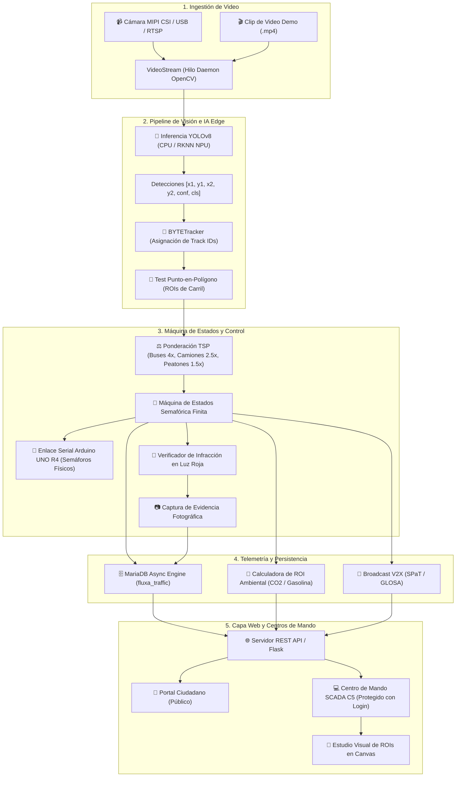

# 📘 FLUXA Smart Mobility • Manual Técnico y Guía de Arquitectura para Desarrolladores

**Plataforma de Control Semafórico Inteligente, Telemetría Edge AI y Gestión de Movilidad Urbana**  
*Tecnológico de Estudios Superiores de Coacalco (TESCo) • Proyecto Smart Cities 2026*

---

## 1. Resumen Ejecutivo y Ficha Técnica

FLUXA es un sistema industrial de control de tráfico adaptativo en tiempo real basado en **Visión por Computadora, Inteligencia Artificial en el Borde (*Edge AI*) y Microcontroladores**. El sistema sustituye los ciclos semafóricos tradicionales de tiempo fijo por un control dinámico basado en demanda vehicular ponderada (TSP), mitigación de emisiones contaminantes y prioridad de emergencias C5.

### Ficha de Especificaciones del Sistema

| Parámetro | Especificación / Valor |
| :--- | :--- |
| **Modelos de Detección** | YOLOv8 (Variantes: Nano `3.2M`, Small `11.2M`, Medium `25.9M`) |
| **Algoritmo de Rastreo** | BYTETracker con Filtro de Kalman y asociación espacial |
| **Aceleración Hardware Edge** | Rockchip RK3588 NPU (3 núcleos, 6 TOPS, cuantización INT8 asimétrica) |
| **Backend CPU de Respaldo** | PyTorch / TorchScript (x86_64, ARM64) |
| **Latencia de Inferencia** | **< 12 ms** (NPU RK3588) / **~35-45 ms** (CPU moderna) |
| **Tasa de Cuadros (FPS)** | 25 - 60 FPS continuos en Edge |
| **Controlador de Potencia** | Arduino UNO R4 Minima (USB CDC ACM, 9600 baudios) con Watchdog Serial |
| **Base de Datos** | MariaDB 10.11+ / MySQL 8.0+ con motor InnoDB |
| **Servidor Web y Streaming** | Flask 3.x con hilos nativos, MJPEG Multipart y WebSockets/REST API |
| **Protocolo V2X** | SPaT (*Signal Phase and Timing*) y GLOSA (*Green Light Optimal Speed Advisory*) |

---

## 2. Arquitectura Global del Sistema

El siguiente diagrama ilustra el flujo de datos unidireccional y bidireccional desde la captura óptica hasta la actuación en semáforos físicos y la nube:



---

## 3. Algoritmos Matemáticos y Fórmulas de Control

### 3.1. Prioridad de Transporte Público (TSP - Transit Signal Priority)
En lugar de contar únicamente el número de unidades físicas, FLUXA calcula la **Demanda Ponderada ($D_j$)** para cada carril $j$:

$$D_j = \sum_{k \in \text{Clases}} w_k \cdot N_{j,k}$$

Donde:
* $N_{j,k}$ es el número de vehículos de la clase $k$ detectados dentro del polígono del carril $j$.
* $w_k$ es el factor de peso asignado según el impacto en movilidad masiva:
  * **Autobús de pasajeros (Clase COCO 5):** $w_5 = 4.0$
  * **Camión de carga / Transporte pesado (Clase COCO 7):** $w_7 = 2.5$
  * **Peatón (Clase COCO 0):** $w_0 = 1.5$
  * **Automóvil particular (Clase COCO 2):** $w_2 = 1.0$
  * **Bicicleta (Clase COCO 1):** $w_1 = 0.8$
  * **Motocicleta (Clase COCO 3):** $w_3 = 0.6$

### 3.2. Asignación Dinámica del Tiempo de Verde
El tiempo asignado a la fase verde activa ($T_{\text{verde}}$) se calcula dinámicamente con una función acotada (*clamped*):

$$T_{\text{verde}} = \min\left(T_{\text{max}}, \max\left(T_{\text{min}}, T_{\text{min}} + f \cdot \max_{j \in \text{Fase}}(D_j)\right)\right)$$

Donde:
* $T_{\text{min}}$: Tiempo mínimo de verde garantizado (default: $5.0\,\text{s}$).
* $T_{\text{max}}$: Tiempo máximo límite de verde (default: $45.0\,\text{s}$).
* $f$: Factor de segundos por auto equivalente (default: $3.0\,\text{s/auto}$).

### 3.3. Modelo de Impacto Ecológico y Ahorro Ciudadano (Smart City ROI)
Para estimar el combustible y emisiones mitigadas en tiempo real frente a un ciclo fijo tradicional de referencia ($T_{\text{fijo}} = 45\,\text{s}$):

1. **Segundos de Espera Ahorrados en el Ciclo ($\Delta t_{\text{espera}}$):**
   $$\Delta t_{\text{espera}} = \max\left(0, T_{\text{fijo}} - T_{\text{verde}}\right) \cdot N_{\text{espera}}$$

2. **Litros de Gasolina Ahorrados ($V_{\text{combustible}}$):**
   Considerando un consumo promedio de $0.8\,\text{litros/hora}$ de un motor en ralentí (*idle*):
   $$V_{\text{combustible}} = \Delta t_{\text{espera}} \cdot \left(\frac{0.8\,\text{L}}{3600\,\text{s}}\right)$$

3. **Kilogramos de $\text{CO}_2$ Mitigados ($M_{\text{CO}_2}$):**
   Utilizando el factor de emisión estándar de $2.31\,\text{kg de CO}_2$ por litro de gasolina no quemado:
   $$M_{\text{CO}_2} = V_{\text{combustible}} \cdot 2.31\,\text{kg/L}$$

### 3.4. Detección de Infracciones en Luz Roja
El algoritmo de fotocívicas ejecuta una validación espaciotemporal en cada cuadro:
1. Se obtiene el estado semafórico activo $S_t \in \{\text{VERDE\_NS}, \text{AMARILLO\_NS}, \text{VERDE\_EO}, \dots\}$.
2. Para cada vehículo rastreado con identificador único $ID_i$ y centroide $(c_x, c_y)$:
   $$\text{Infracción} \iff (c_x, c_y) \in \text{Polígono}(\text{Carril}_j) \land \text{Semaforo}(\text{Carril}_j) = \text{ROJO}$$
3. Para evitar duplicados en el mismo ciclo, se registra la tupla $(S_t, \text{Carril}_j, ID_i)$ en memoria y se dispara el snapshot asíncrono.

---

## 4. Integración con Hardware y Microcontrolador

### 4.1. Conexión Serial con Arduino UNO R4 Minima
* **Puerto:** `/dev/ttyACM0` (con auto-búsqueda en `/dev/ttyACM*` y `/dev/ttyUSB*`).
* **Baudrate:** `9600 baudios, 8N1`.
* **Watchdog:** El hilo `_init_arduino` reintenta la reconexión cada 5 segundos si el cable se desconecta en caliente sin tirar el servidor.

### 4.2. Mapa de Comandos y Pines Físicos

| Comando ASCII | Estado Activado | Relé / LED Arduino | Semáforo Eje NS | Semáforo Eje EO |
| :---: | :--- | :---: | :---: | :---: |
| `'1'` | **VERDE NS** | Pin D2 (Verde NS), Pin D7 (Rojo EO) | 🟢 Verde | 🔴 Rojo |
| `'2'` | **AMARILLO NS** | Pin D3 (Amarillo NS), Pin D7 (Rojo EO) | 🟡 Amarillo | 🔴 Rojo |
| `'3'` | **VERDE EO** | Pin D4 (Rojo NS), Pin D5 (Verde EO) | 🔴 Rojo | 🟢 Verde |
| `'4'` | **AMARILLO EO** | Pin D4 (Rojo NS), Pin D6 (Amarillo EO) | 🔴 Rojo | 🟡 Amarillo |
| `'0'` | **ROJO TOTAL** | Pin D4 (Rojo NS), Pin D7 (Rojo EO) | 🔴 Rojo | 🔴 Rojo |

---

## 5. Especificación de la API REST

### Autenticación y Sesión
* `POST /api/auth/login`: `{ "username": "admin", "password": "..." }` $\to$ Establece cookie de sesión encriptada.
* `POST /api/auth/logout`: Invalida la sesión actual.
* `GET /api/auth/check`: `{ "authenticated": true, "user": "admin" }`.

### Telemetría y Streaming
* `GET /video_feed`: Stream de video multipart MJPEG (`Content-Type: multipart/x-mixed-replace`).
* `GET /api/frame/snapshot`: Imagen JPEG instantánea para el Canvas.
* `GET /api/status`: Paquete completo de estado del sistema (fase activa, autos en carril, telemetría de hardware, Arduino, latencias).
* `GET /api/v2x/spat`: Mensaje SPaT con fase actual, tiempo restante y velocidad aconsejada.
* `GET /api/kpis/sustainability`: Métricas de ahorro de combustible, $\text{CO}_2$ y tiempo.
* `GET /api/history`: Muestras históricas del día para gráficas en tiempo real.
* `GET /api/reports/summary?date=YYYY-MM-DD`: Análisis de hora pico y aforo vehicular desde MariaDB.

### Control y Configuración (Requiere Rol Admin)
* `POST /api/control`: `{ "action": "emergency_corridor", "target": "NS" }` $\to$ Activa corredor verde C5.
* `GET /api/config/full`: Retorna configuración completa (`zones`, `traffic_light`, `ai_model`).
* `POST /api/config/full`: Guarda y aplica polígonos y tiempos en caliente.
* `GET /api/models/list` / `POST /api/models/set`: Lista y conmuta el modelo YOLO en memoria.
* `GET /api/video_source/list` / `POST /api/video_source/set`: Conmuta entre cámara física y videos demo.
* `POST /api/video_source/upload`: Sube un archivo de video con validación de codecs en OpenCV.
* `GET /api/violations`: Lista de infracciones viales con fotos.

---

## 6. Esquema de Base de Datos MariaDB (`fluxa_traffic`)

```sql
CREATE DATABASE IF NOT EXISTS fluxa_traffic CHARACTER SET utf8mb4 COLLATE utf8mb4_unicode_ci;
USE fluxa_traffic;

-- 1. Telemetría vehicular periódica (cada 10 segundos)
CREATE TABLE IF NOT EXISTS telemetry_logs (
    id BIGINT AUTO_INCREMENT PRIMARY KEY,
    timestamp DATETIME NOT NULL,
    topology VARCHAR(32) NOT NULL,
    active_phase VARCHAR(32) NOT NULL,
    total_cars INT NOT NULL,
    lane_counts JSON NOT NULL,
    weighted_demand FLOAT NOT NULL,
    cpu_percent FLOAT NOT NULL,
    cpu_temp_c FLOAT NOT NULL,
    ram_percent FLOAT NOT NULL,
    fps FLOAT NOT NULL,
    INDEX idx_timestamp (timestamp),
    INDEX idx_topology (topology)
) ENGINE=InnoDB;

-- 2. Registro de eventos y auditoría del sistema
CREATE TABLE IF NOT EXISTS system_events (
    id BIGINT AUTO_INCREMENT PRIMARY KEY,
    timestamp DATETIME NOT NULL,
    event_type VARCHAR(16) NOT NULL,
    message VARCHAR(255) NOT NULL,
    INDEX idx_event_type (event_type)
) ENGINE=InnoDB;

-- 3. Registro de infracciones en luz roja (Fotocívicas)
CREATE TABLE IF NOT EXISTS traffic_violations (
    id BIGINT AUTO_INCREMENT PRIMARY KEY,
    timestamp DATETIME NOT NULL,
    lane_name VARCHAR(64) NOT NULL,
    track_id INT NOT NULL,
    phase_state VARCHAR(32) NOT NULL,
    snapshot_path VARCHAR(255) NOT NULL,
    INDEX idx_viol_timestamp (timestamp)
) ENGINE=InnoDB;
```

---

## 7. Guía para Desarrolladores: Cómo Extender el Proyecto

### 7.1. Cómo agregar una nueva Topología Vial
1. Abre [config.json](file:///home/moisesmartinez/PycharmProjects/yolov8srknn/yolov8_semaforo_advanced/config.json) y define los polígonos normalizados bajo `"zones"`:
   ```json
   "mi_nueva_topologia": {
       "carril_1": [[0.1, 0.1], [0.4, 0.1], [0.4, 0.9], [0.1, 0.9]],
       "carril_2": [[0.6, 0.1], [0.9, 0.1], [0.9, 0.9], [0.6, 0.9]]
   }
   ```
2. Crea el controlador en `src/mi_topologia_cpu.py` heredando de `CoreSemaforoBase`:
   ```python
   from core_semaforo import CoreSemaforoBase

   class MiTopologiaController(CoreSemaforoBase):
       def __init__(self, port=None, video_source=None):
           super().__init__(topology_name="mi_nueva_topologia", backend_name="CPU", port=port, video_source=video_source)
           self.estado_actual = "FASE_1"

       def _init_model(self):
           # Inicialización YOLO
           pass

       def _procesar_logica_semaforo(self, autos, tiempo_minimo):
           # Máquina de estados personalizada
           pass
   ```
3. Registra la nueva topología en `src/cli.py` dentro del diccionario `CONTROLADORES`.

---

## 8. Despliegue en Producción (Systemd Daemon)

Para que FLUXA inicie automáticamente al encender el gabinete vial sin login de usuario:

```bash
cd yolov8_semaforo_advanced/systemd
sudo chmod +x install_service.sh
sudo ./install_service.sh
```

Comandos útiles de mantenimiento:
```bash
# Ver estado del servicio
sudo systemctl status fluxa.service

# Ver logs en tiempo real
journalctl -u fluxa.service -f

# Reiniciar servicio
sudo systemctl restart fluxa.service
```
