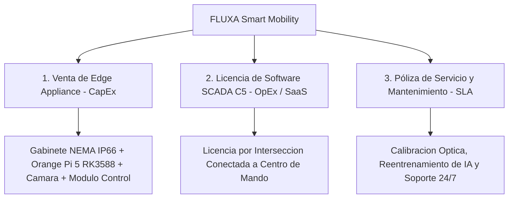

# Modelo de Negocio B2G y Viabilidad Financiera — Sistema FLUXA

**Plataforma de Control Semafórico Inteligente y Telemetría Edge AI**  
*Tecnológico de Estudios Superiores de Coacalco (TESCo) • Tecnológico Nacional de México (TecNM)*  
*Desarrollador Principal y Titular de Derechos: Moisés Emilio Martínez Arias*

---

## 1. Resumen Ejecutivo

**FLUXA** es un producto tecnológico de alto impacto diseñado para resolver la crisis de congestión vial y contaminación urbana en ciudades de México y Latinoamérica mediante **Inteligencia Artificial en el Borde (*Edge AI*)**.

A diferencia de las soluciones extranjeras tradicionales que exigen desechar y reconstruir la infraestructura semafórica existente con costos millonarios, FLUXA opera como una **capa de modernización superpuesta (*Retrofit Overlay Controller*)**. Esto permite transformar cualquier intersección convencional en un cruce inteligente adaptativo con una reducción de hasta el **90% en costos de implementación**.

---

## 2. Problema de Mercado y Oportunidad

1. **Ciclos Semafóricos Rígidos y Tiempos Muertos:** Los semáforos de tiempo fijo provocan que millones de conductores esperen en luz roja ante vías completamente vacías, generando pérdidas de productividad estimadas en más de **3.5 mil millones de horas-hombre al año en México**.
2. **Impacto Ambiental y Combustible:** Los vehículos en ralentí (*idling*) generan emisiones masivas de $CO_2$ y partículas suspendidas ($PM_{2.5}$), además de un sobrecosto severo en combustible para el transporte público y privado.
3. **Altos Costos de la Tecnología Tradicional:** Modernizar una intersección vial con marcas internacionales (Siemens, Econolite, Peek Traffic) cuesta entre **$350,000 y $750,000 MXN por cruce**, volviéndolo inaccesible para la mayoría de los gobiernos municipales.

---

## 3. Propuesta de Valor Económica y Comparativa

| Parámetro | Solución Tradicional Extranjera | Sistema FLUXA Smart Mobility |
| :--- | :--- | :--- |
| **Costo por Intersección (CapEx)** | $350,000 - $750,000 MXN | **$18,000 - $35,000 MXN** |
| **Tiempo de Despliegue** | 2 a 6 semanas (obra civil pesada) | **Menos de 4 horas (Plug & Play)** |
| **Infraestructura Requerida** | Reemplazo total de gabinete y cableado | **Aprovecha gabinete y luces existentes** |
| **Aceleración Hardware** | Servidores centrales costosos en la nube | **NPU Edge local (6 TOPS, sin costo de nube)** |
| **Mando Centralizado** | Plataformas privativas con licencias en USD | **Consola SCADA C5 Web integrada** |
| **Prioridad de Transporte** | Sensores magnéticos invasivos en asfalto | **Visión Artificial con YOLOv8 (TSP Ponderado)** |

---

## 4. Fuentes de Ingresos y Modelo de Monetización (B2G)

El modelo de comercialización se estructura en tres líneas complementarias de ingresos:

### 4.1. Venta de Hardware (*Edge Box Appliance* - Pago Único)
Suministro del kit de grado industrial listo para montaje en mástil o gabinete:
* Computadora de placa reducida (SBC) con NPU Rockchip RK3588 (6 TOPS).
* Microcontrolador de interfaz de potencia y watchdog con aislamiento galvánico.
* Cámara vial de alta resolución con lente gran angular y certificación ambiental.
* Gabinete sellado NEMA / IP66 con supresor de picos y fuente redundante.

### 4.2. Licenciamiento de Software y Mando SCADA C5
* **Esquema de Licencia Perpetua:** Pago por nodo semafórico con derecho a actualizaciones menores.
* **Esquema por Suscripción Anual (MaaS - *Mobility as a Service*):** Acceso al centro de mando unificado C5, analítica de aforo vehicular, emisión de reportes ejecutivos e integración con plataformas de seguridad pública.

### 4.3. Póliza de Servicio, Calibración y Mantenimiento Vial (SLA)
* Calibración inicial de regiones de interés (polígonos de aforo y zonas de detección de peatones).
* Re-entrenamiento periódico de modelos de redes neuronales adaptados a las condiciones de tránsito y parque vehicular del municipio.
* Soporte técnico preventivo y correctivo 24/7 con reemplazo inmediato ante siniestros viales.

---

## 5. Justificación Financiera para Gobiernos (ROI y Payback)

### 5.1. Caso de Estudio Modelado: Corredor Piloto de 10 Intersecciones Urbanas
* **Inversión Inicial Estimada FLUXA (10 Cruces CapEx):** ~$250,000 a $285,000 MXN.
* **Cadena de Supuestos y Modelo de Cálculo (Sujeto a Validación en Campo):**
  1. **Consumo de combustible en ralentí (*idling*):** $0.70\,\text{litros/hora}$ por vehículo ligero (Fuente: *U.S. Department of Energy - AFDC / EPA Idling Reduction Reference Data* y CONUEE).
  2. **Aforo promedio estimado por intersección:** $15,000\,\text{vehículos/día}$ en intersección de 4 accesos.
  3. **Reducción de demora observada en pruebas de control adaptativo:** Promedio estimado de $15.0\,\text{segundos}$ de espera ahorrados por vehículo frente a ciclos de tiempo fijo no sincronizados.
  4. **Precio de referencia del combustible:** $\$24.50\,\text{MXN/litro}$ (Referencia: Comisión Reguladora de Energía - CRE, promedio nacional gasolina regular).

* **Resultados Proyectados del Cálculo:**
  * **Ahorro Diario de Combustible por Cruce:**
    $$\text{Ahorro Diario} = 15,000\,\text{veh/día} \times \left(\frac{15\,\text{s}}{3,600\,\text{s/h}}\right) \times 0.70\,\text{L/h} \approx 43.75\,\text{litros/día/cruce}$$
  * **Ahorro Anual de Combustible por Cruce:**
    $$\text{Ahorro Anual} = 43.75\,\text{L/día} \times 365\,\text{días} \approx 15,968\,\text{litros/año/cruce}$$
  * **Beneficio Económico Ciudadano Anual Estimado:**
    $$15,968\,\text{litros} \times \$24.50\,\text{MXN/L} \approx \$391,216\,\text{MXN anuales por cruce}$$
    *(En un corredor de 10 intersecciones: $\approx \$3.91\,\text{MDP anuales en beneficio social acumulado}$)*.
  * **Mitigación Ambiental Anual:**
    Utilizando el factor de emisión de $2.31\,\text{kg de CO}_2 / \text{litro}$ (Fuente: *EPA Emission Factors / SEMARNAT*):
    $$15,968\,\text{L} \times 2.31\,\text{kg CO}_2/\text{L} \approx 36.88\,\text{toneladas de CO}_2\text{ evitadas al año por cruce}$$
    *(En el corredor de 10 cruces: $\approx 368.8\,\text{toneladas de CO}_2/\text{año}$)*.
* **Periodo de Retorno de Inversión Social (Payback Estimado):** **6 a 18 meses**.
  * *Justificación del rango:* Este periodo es técnica y financieramente creíble debido al reducido costo de adquisición del hardware Edge (*CapEx* de ~$25,000 a $28,500 MXN por cruce frente a los >$350,000 MXN de controladores tradicionales), amortizándose rápidamente a través del ahorro operativo municipal y el impacto socioeconómico directo en la reducción de horas-hombre y combustible en la comunidad.

> [!NOTE]
> *Las cifras anteriores son proyecciones basadas en los supuestos indicados y en las mediciones preliminares de la demo; se validarán con datos reales durante el primer despliegue piloto en campo.*

---

## 6. Estrategia de Propiedad Intelectual y Barreras de Entrada

1. **Registro ante INDAUTOR:** Registro de la obra de software, código fuente y arquitectura FSM a nombre del desarrollador principal (**Moisés Emilio Martínez Arias**).
2. **Propiedad Intelectual de Modelos:** Los pesos cuantizados en formato binario INT8 (`.rknn`) y la configuración geométrica de polígonos constituyen secretos industriales protegidos.
3. **Know-How de Integración Edge-to-Hardware:** La arquitectura multihilo tolerante a fallos (*Zero Double-Free* y conmutación transparente NPU-CPU) representa una ventaja tecnológica difícilmente replicable por competidores de software genérico.

---

## 7. Contacto para Inversión y Vinculación Tecnológica

* **Desarrollador Principal y Titular de Derechos:** Moisés Emilio Martínez Arias
* **Institución:** Tecnológico de Estudios Superiores de Coacalco (TESCo) • TecNM
* **División:** Ingeniería en Sistemas Computacionales
