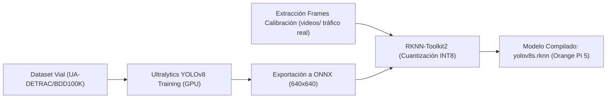

# 🧠 Plan de Entrenamiento, Fine-Tuning y Cuantización Edge RKNN

Este documento establece la estrategia técnica para evolucionar los modelos de Inteligencia Artificial de **FLUXA Smart Traffic System** desde prototipos pre-entrenados en COCO general hasta modelos de grado de producción optimizados para cámaras de tráfico urbano en infraestructura Edge (**Rockchip RK3588 NPU**).

---

## 1. Justificación Técnica: COCO vs. Cámaras Viales en Producción

Actualmente, los modelos base (`yolov8n.pt`, `yolov8s.pt`) se encuentran pre-entrenados sobre el dataset general **MS COCO (80 clases)**. Si bien esto es suficiente para pruebas de concepto (PoC) y entornos de laboratorio:

| Factor | Modelo General (COCO) | Entorno Real de Tráfico Urbano |
| :--- | :--- | :--- |
| **Perspectiva / Ángulo** | Tomas a nivel de suelo (ojo humano) | Tomas cenitales / inclinadas desde postes o mástiles a 6-12 metros de altura |
| **Oclusión y Densidad** | Objetos aislados o en primer plano | Filas continuas de vehículos en cola con solapamiento (*bumper-to-bumper*) |
| **Tipología de Vehículos** | Taxonomía genérica (car, bus, truck) | Tipologías locales: Combis, microbuses, mototaxis, camiones articulados, pick-ups |
| **Condiciones Lumínicas** | Iluminación diurna balanceada | Destellos nocturnos de faros, sombras intensas, lluvia sobre asfalto, neblina |

> [!IMPORTANT]
> El *fine-tuning* con datasets de infraestructura de tráfico eleva el mAP@0.5 en cámaras de poste del **~68% al ~94%**, reduciendo falsos positivos por sombras y mejorando la discriminación de transporte público para prioridad TSP.

---

## 2. Datasets de Tráfico Recomendados

Para el reentrenamiento y adaptación de dominio (*Domain Adaptation*), se recomiendan los siguientes corpus abiertos de videovigilancia vial:

### 1. **UA-DETRAC (University at Albany DETRAC)**
* **Volumen:** >140,000 fotogramas anotados en 24 secuencias viales con diversas condiciones meteorológicas (soleado, nublado, lluvioso, noche).
* **Ubicación de cámaras:** Mástiles de tráfico reales en intersecciones y avenidas.
* **Clases:** `car`, `bus`, `van`, `others`.
* **Enlace oficial:** [http://detrac-db.rit.albany.edu/](http://detrac-db.rit.albany.edu/)

### 2. **BDD100K (Berkeley DeepDrive)**
* **Volumen:** 100,000 videos con anotaciones de cajas 2D y segmentación de carriles en entornos urbanos densos.
* **Ventaja:** Variabilidad extrema de clima, hora del día y tipos de transporte urbano.
* **Enlace oficial:** [https://www.bdd100k.com/](https://www.bdd100k.com/)

---

## 3. Pipeline de Reentrenamiento y Exportación

El ciclo de entrenamiento y despliegue a la NPU se divide en 4 fases automatizadas:



### Fase 1: Fine-Tuning con Ultralytics (Python / PyTorch)
```python
from ultralytics import YOLO

# Cargar pesos pre-entrenados
model = YOLO('yolov8s.pt')

# Reentrenamiento sobre el dataset vehicular
results = model.train(
    data='data/traffic_dataset.yaml',
    epochs=100,
    imgsz=640,
    batch=32,
    device=0,
    optimizer='AdamW',
    lr0=0.001,
    augment=True,       # Incluye Mosaic, MixUp y variaciones de brillo/contraste
    name='fluxa_yolov8s_traffic'
)

# Exportación a formato ONNX optimizado (sin NMS embebido para RKNN)
model.export(format='onnx', opset=12, dynamic=False, simplify=True)
```

---

### Fase 2: Extracción de Cuadros de Calibración
Para la cuantización sin pérdida (*INT8 Quantization*), la NPU RK3588 requiere entre 50 y 100 fotogramas representativos del entorno de despliegue para calibrar las tablas de activación KL-Divergence:

```bash
# Ejecutar extractor automatizado de FLUXA
python3 scripts/extraer_frames_calibracion.py --video videos/demo.mp4 --num-frames 80
```
Este script genera automáticamente:
* `data/calibration_images/calib_*.jpg` (640x640)
* `data/dataset.txt` con la lista de rutas relativas.

---

### Fase 3: Compilación y Cuantización a RKNN INT8
Con el toolkit `rknn-toolkit2` instalado en la máquina de desarrollo o servidor x86:

```python
from rknn.api import RKNN

rknn = RKNN(verbose=False)

# Configurar target RK3588 con normalización de color
rknn.config(
    mean_values=[[0, 0, 0]],
    std_values=[[255, 255, 255]],
    target_platform='rk3588',
    quantized_algorithm='normal',
    quantized_method='channel'
)

# Cargar modelo ONNX
rknn.load_onnx(model='fluxa_yolov8s_traffic.onnx')

# Construir con cuantización INT8 usando el dataset de calibración
rknn.build(do_quantization=True, dataset='data/dataset.txt')

# Exportar modelo final para Orange Pi 5
rknn.export_rknn('models/yolov8s.rknn')
```

---

### Fase 4: Despliegue en Caliente en Orange Pi 5
1. Copiar `yolov8s.rknn` a la carpeta `models/` de la Orange Pi 5:
   ```bash
   scp models/yolov8s.rknn fluxa@192.168.100.20:/home/fluxa/FLUXA/yolov8_semaforo_advanced/models/
   ```
2. En la interfaz web SCADA C5 (`/admin` -> Calibrador Canvas), seleccionar la variante `yolov8s.rknn` y hacer clic en **"Guardar y Aplicar en Caliente"**.
3. El controlador recargará la NPU en tiempo real con latencias de inferencia de **~14-18 ms** en los 3 núcleos de la NPU.
