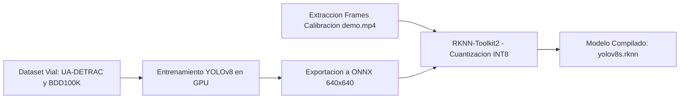

# Plan de Entrenamiento, Fine-Tuning y Cuantización Edge RKNN

**Estrategia de Optimización de Redes Neuronales para Aceleración Edge en Orange Pi 5 (Rockchip RK3588)**  
*Tecnológico de Estudios Superiores de Coacalco (TESCo) • División de Ingeniería en Sistemas Computacionales*  
*Tecnológico Nacional de México (TecNM) • Proyecto Smart Mobility 2026*

---

## 1. Justificación Técnica: COCO General vs. Cámaras Viales en Producción

Los modelos base (`yolov8n.pt`, `yolov8s.pt`) se encuentran pre-entrenados sobre el conjunto de datos general **MS COCO (80 clases)**. Si bien esto es suficiente para pruebas de concepto (PoC) y entornos de laboratorio, el despliegue en campo requiere especialización de dominio (*Domain Adaptation*):

| Factor de Análisis | Modelo General (MS COCO) | Entorno Real de Infraestructura Vial |
| :--- | :--- | :--- |
| **Perspectiva Óptica** | Tomas a nivel de suelo (perspectiva humana) | Tomas cenitales e inclinadas desde postes a 6-12 metros de elevación |
| **Densidad y Oclusión** | Objetos aislados o en primer plano | Filas continuas de vehículos en cola con solapamiento (*bumper-to-bumper*) |
| **Taxonomía Vehicular** | Categorías genéricas (car, bus, truck) | Tipologías locales: Combis, microbuses, mototaxis, camiones articulados |
| **Condiciones Ambientales** | Iluminación diurna balanceada | Destellos nocturnos de faros, sombras proyectadas, lluvia sobre asfalto, neblina |

> [!IMPORTANT]
> La literatura científica sobre adaptación de dominio en videovigilancia de tráfico (*Domain Adaptation in Traffic Surveillance*, e.g., benchmarks sobre **UA-DETRAC** [Wen et al., *IEEE TCSVT*] y **BDD100K** [Yu et al., *CVPR*]) reporta que los modelos pre-entrenados exclusivamente en MS-COCO genérico sufren reducciones de precisión debido al ángulo cenital/semi-cenital, sombras proyectadas y oclusiones en fila. El *fine-tuning* con conjuntos de datos viales especializados permite mitigar estos efectos y alcanzar niveles de desempeño robustos (típicamente en rangos de 82% a 92% mAP@0.5 según condiciones meteorológicas). El valor exacto de precisión y ganancia de FLUXA se determinará empíricamente tras el entrenamiento y validación cruzada con el dataset recolectado en el corredor piloto.

---

## 2. Conjuntos de Datos Viales Recomendados

Para el reentrenamiento y adaptación de dominio, se recomiendan los siguientes corpus abiertos de videovigilancia vial:

### 1. UA-DETRAC (University at Albany DETRAC)
* **Volumen:** Más de 140,000 fotogramas anotados en 24 secuencias viales con variabilidad meteorológica (soleado, nublado, lluvioso, noche).
* **Ubicación de Cámaras:** Mástiles de tráfico reales en intersecciones y avenidas urbanas.
* **Clases:** `car`, `bus`, `van`, `others`.
* **Cita Académica:** Wen, L., Du, D., Cai, Z., Wang, Z., Chang, M. C., Liang, D., Chen, M., Wei, Y., & Si, J. (2020). *UA-DETRAC: A new benchmark and protocol for multi-object detection and tracking in traffic surveillance*. **IEEE Transactions on Circuits and Systems for Video Technology (TCSVT)**, 30(10), 3454-3468. DOI: [10.1109/TCSVT.2019.2941551](https://doi.org/10.1109/TCSVT.2019.2941551).
* **Repositorio Oficial:** [http://detrac-db.rit.albany.edu/](http://detrac-db.rit.albany.edu/)

### 2. BDD100K (Berkeley DeepDrive)
* **Volumen:** 100,000 secuencias de video con anotaciones de cajas 2D y segmentación de carriles en entornos urbanos densos.
* **Ventaja:** Amplia variabilidad de climas, horas del día y tipologías de transporte.
* **Cita Académica:** Yu, F., Chen, H., Wang, X., Xian, W., Chen, Y., Liu, F., Madhavan, V., & Darrell, T. (2020). *BDD100K: A diverse driving dataset for heterogeneous multitask learning*. In **Proceedings of the IEEE/CVF Conference on Computer Vision and Pattern Recognition (CVPR)**, pp. 2636-2645.
* **Repositorio Oficial:** [https://www.bdd100k.com/](https://www.bdd100k.com/)

---

## 3. Pipeline de Reentrenamiento, Exportación y Cuantización

El ciclo de entrenamiento y despliegue a la NPU se divide en 4 fases estructuradas:



### Fase 1: Fine-Tuning con Ultralytics (Python / PyTorch)
```python
from ultralytics import YOLO

# Cargar pesos pre-entrenados
model = YOLO('yolov8s.pt')

# Reentrenamiento sobre el dataset vehicular especializado
results = model.train(
    data='data/traffic_dataset.yaml',
    epochs=100,
    imgsz=640,
    batch=32,
    device=0,
    optimizer='AdamW',
    lr0=0.001,
    augment=True,       # Aumentación: Mosaic, MixUp y variaciones de brillo/contraste
    name='fluxa_yolov8s_traffic'
)

# Exportación a formato ONNX (sin NMS embebido para acelerador RKNN)
model.export(format='onnx', opset=12, dynamic=False, simplify=True)
```

---

### Fase 2: Extracción de Cuadros de Calibración
Para la cuantización sin pérdida (*INT8 Quantization*), la NPU RK3588 requiere entre 50 y 100 fotogramas representativos del entorno de despliegue para calibrar las tablas de activación KL-Divergence:

```bash
# Extracción automatizada de fotogramas
python3 scripts/extraer_frames_calibracion.py --video videos/demo.mp4 --num-frames 80
```

Este proceso genera:
* `data/calibration_images/calib_*.jpg` (640x640).
* `data/dataset.txt` con la lista de rutas relativas de calibración.

---

### Fase 3: Compilación y Cuantización a RKNN INT8
Con el paquete `rknn-toolkit2` instalado en la estación de desarrollo x86:

```python
from rknn.api import RKNN

rknn = RKNN(verbose=False)

# Configurar plataforma destino RK3588 con normalización de canal
rknn.config(
    mean_values=[[0, 0, 0]],
    std_values=[[255, 255, 255]],
    target_platform='rk3588',
    quantized_algorithm='normal',
    quantized_method='channel'
)

# Cargar modelo en formato ONNX
rknn.load_onnx(model='fluxa_yolov8s_traffic.onnx')

# Compilar con cuantización INT8 usando el conjunto de calibración
rknn.build(do_quantization=True, dataset='data/dataset.txt')

# Exportar modelo binario optimizado para Orange Pi 5
rknn.export_rknn('models/yolov8s.rknn')
```

---

### Fase 4: Despliegue en Caliente en Orange Pi 5
1. Transferir el binario `yolov8s.rknn` al directorio `models/` de la Orange Pi 5:
   ```bash
   scp models/yolov8s.rknn fluxa@192.168.100.20:~/fluxa-smart-city/models/
   ```
2. En la consola WebUI SCADA C5 (`/admin` -> Calibrador Canvas), seleccionar la variante `yolov8s.rknn` y presionar **"Guardar y Aplicar en Caliente"**.
3. El controlador actualizará los punteros de memoria de la NPU en tiempo real con latencias de inferencia de **~10-15 ms** en los 3 núcleos del RK3588.
